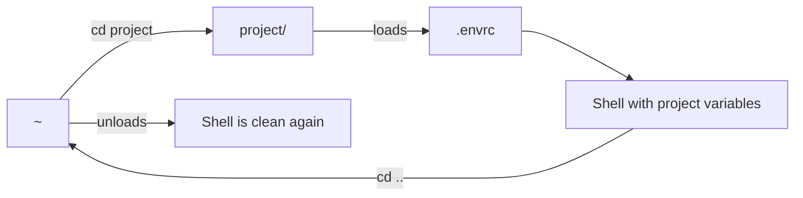

# Managing Environments with direnv

You're working on three different projects. Project A needs `AWS_PROFILE=prod`, Project B needs `KUBECONFIG=~/.kube/dev-config`, and Project C requires a specific API key. You constantly forget to switch your variables, leading to "oops" commits or failed commands. **This is why you need `direnv`.**

`direnv` is an extension for your shell that loads and unloads environment variables depending on your current directory. It allows you to define project-specific environments that "just work" the moment you `cd` into a folder.

## Quick Start: The 30-Second Setup

1.  **Install**: `brew install direnv` (or your package manager of choice).
2.  **Hook**: Add `eval "$(direnv hook zsh)"` (or bash) to your shell config.
3.  **Use**: 
    - Go to your project: `cd my-project`
    - Create an environment file: `echo "export AWS_PROFILE=staging" > .envrc`
    - Allow it: `direnv allow`

## How Direnv Works

`direnv` checks for a `.envrc` file every time your shell prompt appears. If it finds one, it loads the variables. When you `cd` out of that directory, it automatically unloads them, keeping your shell environment clean.



## Why Direnv Matters for Platform Work

SREs handle multiple contexts—staging, production, different cloud accounts, and local clusters. Manual context switching is a major source of human error. `direnv` automates the context, reducing the risk of running a production command in a staging environment.

### Common Scenarios

=== ":material-aws: Cloud Profiles"

    Ensure you are always using the correct AWS profile for the infrastructure code you are editing:
    ```bash title=".envrc"
    export AWS_PROFILE=platform-dev
    export AWS_REGION=us-east-1
    ```

=== ":material-kubernetes: Kubeconfig Isolation"

    Avoid accidentally running `kubectl delete` on the wrong cluster:
    ```bash title=".envrc"
    export KUBECONFIG=$(expand_path ./kubeconfig.yaml)
    ```

=== ":material-snake: Python Virtual Environments"

    Automatically activate your `venv` when you enter the project directory:
    ```bash title=".envrc"
    layout python3  # Built-in shortcut to find/create a venv
    ```

## Best Practices and Security

<div class="grid cards" markdown>

-   :material-security: **Never Commit `.envrc`**

    ---

    **Why it matters:** `.envrc` often contains secrets or local paths. Always add it to your `.gitignore`.

-   :material-file-lock: **The `.env` Pattern**

    ---

    **Why it matters:** If you already use `.env` files for Docker, you can load them into `direnv`:
    `dotenv` (inside your `.envrc`).

-   :material-check-decagram: **Explicit Approval**

    ---

    **Why it matters:** `direnv` won't run a new or changed `.envrc` until you run `direnv allow`. This prevents malicious scripts from running automatically when you clone a repo.

</div>

## Practice Problems

??? question "Practice Problem 1: Unloading Variables"

    You have `export FOO=bar` in your `project/.envrc`. You `cd` into `project/`, and `echo $FOO` prints `bar`. You then `cd ..`. What does `echo $FOO` print now?

    ??? tip "Answer"

        It will print **nothing** (or whatever the value of `$FOO` was before you entered the directory). `direnv` takes a snapshot of your environment before loading and restores it exactly when you leave.

??? question "Practice Problem 2: Security"

    Why does `direnv` require you to run `direnv allow` after every change to a `.envrc` file?

    ??? tip "Answer"

        This is a security feature to prevent **unauthorized code execution**. Since `.envrc` is a shell script, someone could theoretically send you a project with a `.envrc` that runs `rm -rf /`. By requiring manual approval for every change, `direnv` ensures you have the opportunity to inspect the file.

## Key Takeaways

| Command | Action |
|:--------|:-------|
| `direnv allow` | Authorize the `.envrc` in the current dir |
| `direnv deny` | Revoke authorization |
| `direnv edit .` | Open the `.envrc` in your `$EDITOR` |
| `layout <type>` | Use built-in templates (python, ruby, go) |
| `dotenv` | Load standard `.env` files |

## Further Reading

### Official Documentation
- [Direnv.net](https://direnv.net/) - Official website and documentation.
- [Direnv Wiki](https://github.com/direnv/direnv/wiki) - Community recipes and advanced usage.

### Related Tools & Alternatives
- [Autoenv](https://github.com/hyperupcall/autoenv) - A simpler, bash-only alternative.
- [Shadowenv](https://github.com/Shopify/shadowenv) - Shopify's take on directory-local environments.

### Deep Dives
- [Process Environments](https://cs.bradpenney.io/building_blocks/computational_thinking/) - How Unix processes inherit and manage environment variables.
- [Shell Hooks](https://cs.bradpenney.io/building_blocks/how_parsers_work/) - How `direnv` uses the `$PROMPT_COMMAND` or `precmd` to trigger its checks.
