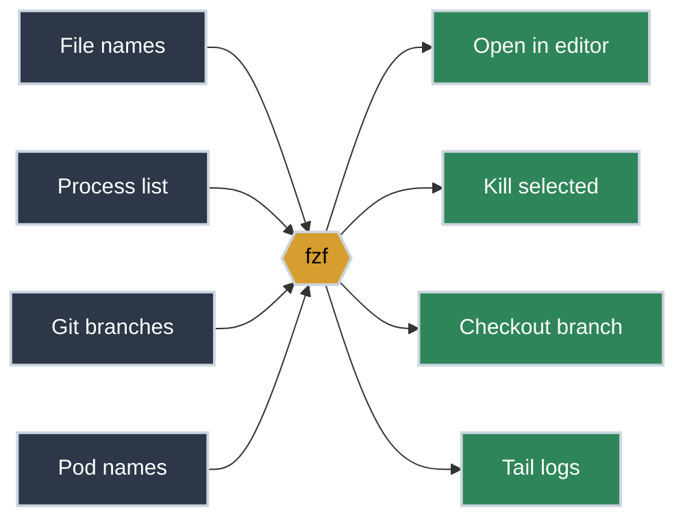

# FZF Mastery: The Interactive Glue

<!-- PATHWAY_ROADMAP:START -->
<div class="pathway-pills" markdown>
:material-map-marker-path: <span class="pathway-pills__label">Part of a pathway:</span> [Debugging With Nothing But a Terminal](https://bradpenney.io/pathways/nothing-but-a-terminal){: .pathway-pill }
</div>

??? abstract ":material-map-legend: Consult the map"

    <div class="grid cards" markdown>

    -   :material-console: __Debugging With Nothing But a Terminal__ — step 14 of 20

        ---

        ← [tmux](https://tools.bradpenney.io/efficiency/tmux/) · **you are here** · [Multiple AI CLIs, One tmux Session](https://tools.bradpenney.io/efficiency/multiple_ai_clis_tmux/) →

        [Start the pathway →](https://bradpenney.io/pathways/nothing-but-a-terminal)

    </div>
<!-- PATHWAY_ROADMAP:END -->

Basic history searching (`Ctrl+r`) is most people's first and only use of `fzf`. But `fzf` is more than a history tool — it's a **universal interactive filter**, the "glue" that turns static lists into interactive workflows. **This is how custom CLI interfaces get built.**

`fzf` takes any list of text, lets you filter it in real-time, and outputs your selection. This simple primitive can be combined with almost any other tool to create powerful, custom workflows.

## Installation

=== ":material-linux: Linux"

    ```bash title="Install fzf on Linux" linenums="1"
    # Debian/Ubuntu
    sudo apt-get update && sudo apt-get install fzf

    # RHEL/CentOS/Fedora
    sudo dnf install fzf
    ```

=== ":material-apple: macOS"

    ```bash title="Install fzf on macOS" linenums="1"
    brew install fzf
    $(brew --prefix)/opt/fzf/install  # (1)!
    ```

    1. Sets up the `Ctrl+r` history and `Ctrl+t` file-widget key bindings for your shell.

=== ":material-microsoft-windows: Windows"

    ```bash title="Install fzf on Windows" linenums="1"
    choco install fzf
    # or
    scoop install fzf
    ```

## The Core Concept: One Filter, Many Lists

The same primitive sits in front of almost any list you'd otherwise scroll through by hand:



Every alias and scenario below is the same shape: pipe a list in, get one selection out, hand it to the next command.

## Quick Start: The One-Liners

Add these to your aliases for immediate impact:

```bash title="FZF Multipliers" linenums="1"
# Select a file and open it in your editor
alias fo='fd --type f | fzf | xargs -r ${EDITOR:-vim}'

# Select a process to kill
alias pk='ps -ef | fzf --header-line=1 | awk "{print \$2}" | xargs kill -9'

# Select a git branch to checkout
alias gc='git branch | fzf | xargs git checkout'
```

## Why FZF Matters for Platform Work

SREs spend their time navigating complex namespaces and large numbers of resources. `fzf` allows you to navigate these without having to memorize names or copy-paste from the terminal.

### Common Scenarios

=== ":material-kubernetes: Interactive Pod Logs"

    Stop typing pod names manually. Select from a live list:
    ```bash title="Interactive Logs" linenums="1"
    kl() {
      kubectl logs -f $(kubectl get pods -o name | fzf --prompt="Pod > ")
    }
    ```

=== ":material-docker: Cleaning Up Containers"

    Select multiple containers to stop and remove at once:
    ```bash title="Bulk Cleanup" linenums="1"
    dc() {
      docker ps -a --format '{{.ID}}	{{.Names}}	{{.Status}}' | 
      fzf --multi --header-line=0 | awk '{print $1}' | xargs docker rm -f
    }
    ```

=== ":material-history: Searching JSON with fzf"

    Use `fzf` to explore large JSON files interactively (requires `jq`):
    ```bash title="JSON Browser" linenums="1"
    # Select a key from a JSON object
    cat config.json | jq -r 'keys[]' | fzf | xargs -I {} jq '.{}' config.json
    ```

## Advanced FZF Features

Three flags turn a basic selector into a real interface:

<div class="grid cards" markdown>

-   :material-eye: **The Preview Window**

    ---

    **Why it matters:** See the contents of a file or the details of a resource *before* you select it, instead of guessing from the filename alone.

    ```bash title="Preview Files While Filtering" linenums="1"
    fzf --preview 'bat --color=always {}'
    ```

-   :material-cursor-default-click: **Multi-Select (`-m`)**

    ---

    **Why it matters:** Select multiple items using `Tab`, then act on all of them at once. Perfect for bulk operations like deleting a batch of files or stopping several services.

    ```bash title="Select Multiple Files, Then Remove Them" linenums="1"
    fzf --multi | xargs -r rm
    ```

-   :material-keyboard: **Custom Bindings**

    ---

    **Why it matters:** Bind keys within `fzf` itself to perform actions on the highlighted item, without exiting the selector first.

    ```bash title="Open a File in Vim Without Leaving fzf" linenums="1"
    fzf --bind 'ctrl-e:execute(vim {})'
    ```

</div>

## Practice Problems

??? question "Practice Problem 1: Previews"

    How would you create an `fzf` command that lists all files in the current directory and shows a preview of the first 10 lines of each file as you move through the list?

    ??? tip "Answer"

        ```bash title="Preview First 10 Lines of Each File" linenums="1"
        fzf --preview 'head -n 10 {}'
        ```

??? question "Practice Problem 2: Extraction"

    When you pipe `ps -ef` into `fzf`, the output contains many columns. How do you extract just the PID (the second column) of the selected line?

    ??? tip "Answer"

        ```bash title="Extract the PID Column from a Selection" linenums="1"
        ps -ef | fzf | awk '{print $2}'
        ```
        `awk` is the perfect partner for `fzf` when you need to extract specific fields from a structured line of text.

## Key Takeaways

| Feature | Flag | Purpose |
|:--------|:-----|:--------|
| **Multi-select**| `-m` or `--multi` | Select multiple items with `Tab` |
| **Preview** | `--preview 'cmd'` | Run a command on the current item |
| **Prompt** | `--prompt 'text'` | Change the input prompt |
| **Header** | `--header 'text'` | Add a static header at the top |
| **Exact Match** | `-e` | Use exact matching instead of fuzzy |

## What's Next

If you're following the [Debugging With Nothing But a Terminal](https://bradpenney.io/pathways/nothing-but-a-terminal) pathway, the next step is **[Multiple AI CLIs, One tmux Session](multiple_ai_clis_tmux.md)** — filtering one list interactively is one pane's worth of work; the next step is running several panes at once and moving answers between them.

## Further Reading

### Official Documentation
- [fzf Wiki: Examples](https://github.com/junegunn/fzf/wiki/examples) - A treasure trove of community-built functions.
- [fzf Manual](https://github.com/junegunn/fzf/blob/master/man/man1/fzf.1) - Detailed reference for all flags and bindings.

### Related Tools & Alternatives
- [Skim](https://github.com/lotabout/skim) - A similar fuzzy finder written in Rust.
- [Peco](https://github.com/peco/peco) - Another interactive filtering tool.

### Deep Dives
- [Pipes and Redirection](https://linux.bradpenney.io/essentials/pipes_and_redirection/) - The core Unix philosophy — small tools connected by pipes — that makes `fzf` so powerful as connective tissue.
