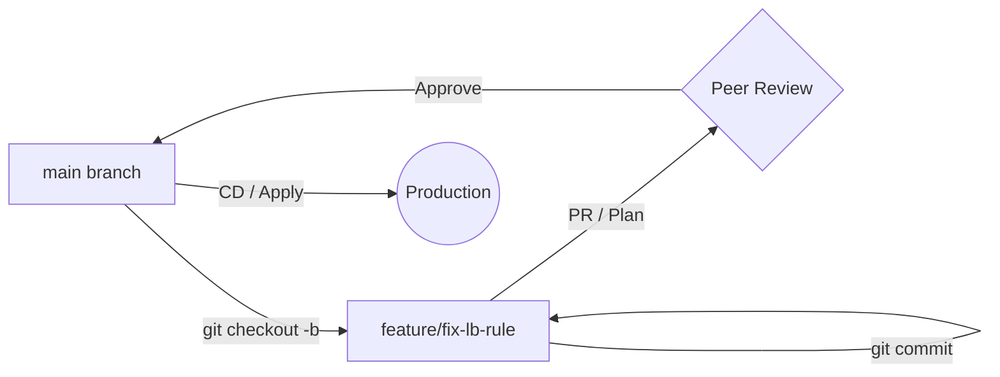

# Git Workflows for Infrastructure

You've made a change to a Terraform module in your feature branch. Meanwhile, a colleague merged a change to the same file in `main`. Now you have a merge conflict in a 500-line YAML file. **This is where a solid workflow saves your day.**

In Platform Engineering, we don't just use Git to save code; we use it to coordinate changes to live environments. A structured workflow ensures that infrastructure changes are reviewed, tested, and deployed without causing outages.

## The Feature Branch Workflow (IaC Edition)

This is the industry standard for managing infrastructure changes. It prioritizes peer review and automated testing (CI) before any change touches production.



## Quick Start: The 5-Step Workflow

1.  **Sync**: `git checkout main && git pull origin main`
2.  **Branch**: `git checkout -b feat/add-logging`
3.  **Work**: Make changes, `git add`, and `git commit -m "feat: add logging to api"`
4.  **Update**: `git fetch origin main && git rebase origin/main` (Keep your branch up to date)
5.  **Push**: `git push origin feat/add-logging` and open a Pull Request.

## Why Workflows Matter for Platform Work

A bad Git workflow in application dev might delay a feature. A bad Git workflow in platform engineering can take down an entire region.

### Common Scenarios

=== ":material-source-merge: Resolving YAML Conflicts"

    YAML is whitespace-sensitive. When Git shows a conflict, it can be hard to see where the indentation broke.
    - Use a visual merge tool or VS Code's conflict resolution UI.
    - **Always** run `yq` or a linter on the file after resolving a conflict to ensure the syntax is still valid.
    - `yq eval '.' config.yaml` (If this fails, your resolution is broken).

=== ":material-history: Linear History with Rebasing"

    Platform teams often prefer `rebase` over `merge` for feature branches. This keeps the history linear and makes it easier to track when a specific infrastructure change was introduced.
    - `git rebase main` moves your changes to the "tip" of the current main branch.
    - It avoids "Merge branch 'main' into feature" noise in your logs.

=== ":material-comment-check: Atomic Infrastructure Commits"

    Each commit should represent a single, logical change to the infrastructure.
    - **Bad**: `git commit -m "updated stuff"` (Changes firewall, DNS, and IAM in one go).
    - **Good**: `git commit -m "feat: add egress rule for database"` (Focused and easy to revert).

## Core Workflow Patterns

<div class="grid cards" markdown>

-   :material-source-pull: **Pull Request (PR) Culture**

    ---

    **Why it matters:** PRs aren't just for code review; they are for "Plan" review. Attach your `terraform plan` or `kustomize build` output to the PR.

-   :material-tag-check: **Protected Branches**

    ---

    **Why it matters:** Ensure that no one can push directly to `main`. Require at least one approval and passing CI checks (linting, security scans).

-   :material-undo: **Revert Strategy**

    ---

    **Why it matters:** If an infrastructure change causes an incident, the fastest way back is often `git revert`. Practice this before you need it.

</div>

## Practice Problems

??? question "Practice Problem 1: Rebase vs Merge"

    You are on a feature branch and `main` has moved forward. You want to incorporate those changes while keeping your own commits at the top of the history. Which command do you use?

    ??? tip "Answer"

        ```bash
        git fetch origin
        git rebase origin/main
        ```
        `rebase` reapplies your commits on top of the new base, resulting in a cleaner, linear history.

??? question "Practice Problem 2: Validating After Conflict"

    You just resolved a conflict in a Kubernetes `Deployment.yaml`. What is the most important thing to do before committing the resolution?

    ??? tip "Answer"

        Validate the syntax! Use a tool like `yq`, `yamllint`, or `kubectl diff`. A single indentation error during a manual merge resolution can prevent the file from being parsed by your CD pipeline.

## Key Takeaways

| Action | Command / Strategy |
|:-------|:-------------------|
| **Syncing** | `git pull --rebase origin main` |
| **Branching**| `git checkout -b <type>/<description>` |
| **Updating** | `git rebase main` |
| **Cleaning** | `git commit --amend` (for fixups) |
| **Validating**| `yq eval '.' <file>` |

## Further Reading

### Official Documentation
- [Git Branching - Workflows](https://git-scm.com/book/en/v2/Git-Branching-Branching-Workflows) - From the Pro Git book.
- [GitHub Flow](https://docs.github.com/en/get-started/quickstart/github-flow) - A simple, branch-based workflow.

### Related Tools & Alternatives
- [Trunk Based Development](https://trunkbaseddevelopment.com/) - An alternative to long-lived feature branches.
- [GitLab Flow](https://docs.gitlab.com/ee/topics/gitlab_flow.html) - Workflow incorporating environment branches (Staging, Production).

### Deep Dives
- [DAG Manipulation](https://cs.bradpenney.io/building_blocks/binary_trees_and_representation/) - Understanding how `rebase` and `merge` rewrite the project graph.
- [Infrastructure as Code Testing](https://cs.bradpenney.io/building_blocks/how_parsers_work/) - Why linting and validation are critical parts of the Git workflow.
