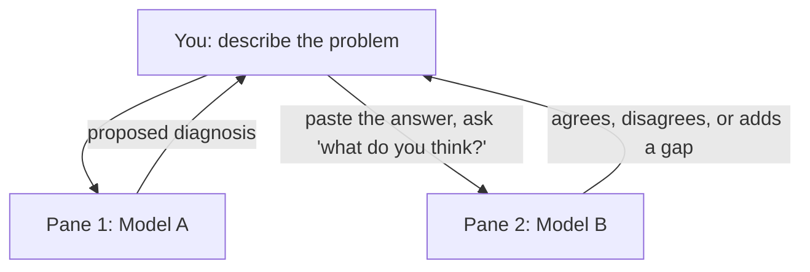

# Multiple AI CLIs, One tmux Session

<!-- PATHWAY_ROADMAP:START -->
<div class="pathway-pills" markdown>
:material-map-marker-path: <span class="pathway-pills__label">Part of a pathway:</span> [Debugging With Nothing But a Terminal](https://bradpenney.io/pathways/nothing-but-a-terminal){: .pathway-pill }
</div>

??? abstract ":material-map-legend: Consult the map"

    <div class="grid cards" markdown>

    -   :material-console: __Debugging With Nothing But a Terminal__ — step 15 of 20

        ---

        ← [FZF Mastery](https://tools.bradpenney.io/efficiency/fzf_advanced/) · **you are here** · [Git Basics](https://tools.bradpenney.io/essentials/git/git_basics/) →

        [Start the pathway →](https://bradpenney.io/pathways/nothing-but-a-terminal)

    </div>
<!-- PATHWAY_ROADMAP:END -->

You're mid-incident. You ask an AI CLI running in your terminal to explain a stack trace, and it comes back with a confident, specific, plausible-sounding root cause. It's also the only opinion you've got. Before this generation of tooling, "get a second opinion" meant paging a colleague. Now it can mean splitting your `tmux` session and asking a second model the same question — in the time it takes to switch panes.

This isn't about the tools individually — it's [tmux](tmux.md) from the last article, applied to a workflow that didn't exist a few years ago.

## Prerequisites

This article assumes you're already comfortable with `tmux` panes and windows from the previous article. If `Prefix` + `%` and `Prefix` + `Arrow Keys` aren't muscle memory yet, start there first.

## Installation

You need at least one AI CLI installed; the technique works with any combination.

=== ":material-robot: Claude Code"

    ```bash title="Install Claude Code" linenums="1"
    npm install -g @anthropic-ai/claude-code
    ```

=== ":material-robot-outline: Other AI CLIs"

    Codex CLI (OpenAI) and Gemini CLI (Google) are both distributed as npm packages and installed the same way — `npm install -g <package>`. Package names and flags change faster than this article can track, so check each tool's own install docs for the current command rather than trusting a copy-pasted one here.

## The Core Idea: Panes as Independent Reviewers

Once at least one CLI is installed, the setup is nothing more than the pane mechanics from the last article, pointed at a new use: instead of one pane running `htop` and another tailing logs, each pane runs its own model, and you carry information between them by hand.



The trick isn't a new tool — it's a discipline. Each pane is a separate process with its own context; nothing you say to Model A is visible to Model B unless you put it there yourself. That isolation is the entire point. You're not asking one assistant to double-check itself; you're asking a second, unrelated one to react to the first one's answer cold.

## Setting Up the Panes

The split itself is two commands you already know from the last article:

```bash title="Two AI CLIs, Side by Side" linenums="1"
tmux new -s incident      # (1)!
tmux split-window -h      # (2)!
```

1. Start a fresh session for this incident, same as any other `tmux` workflow.
2. Split vertically. Run your first AI CLI in the left pane, a second one in the right.

For a three-way split, add `tmux split-window -v` inside one of the two panes — one incident window, one system-monitoring pane if you want it, and two (or three) model panes.

## The Cross-Examination Move

With both panes running, the technique itself is three moves, in order:

=== ":material-numeric-1-circle: Ask the First Question"

    In pane 1, describe the problem and let the model propose a diagnosis or a fix — something concrete, like "here's a stack trace from the checkout service, what's the likely cause?" rather than a vague "what's wrong with this." Treat the answer as a draft, not a verdict — this is true of any single AI CLI answer, with or without a second opinion.

=== ":material-numeric-2-circle: Move the Answer, Not Just the Question"

    Switch panes (`Prefix` + `Arrow Key`), and paste pane 1's actual answer into pane 2 — not a paraphrase of it. Ask something specific: "Here's another model's diagnosis of this stack trace. What's missing, or what would you check before trusting it?"

    Pasting the real answer matters. A vague "what do you think about X bug" gets a generic response; a concrete claim to react to gets a concrete critique.

=== ":material-numeric-3-circle: Weigh the Disagreement, Don't Just Average It"

    If both agree, that's mild evidence, not proof — correlated training data can produce correlated blind spots. If they disagree, that disagreement is the actual signal: it's telling you exactly where the ambiguity in your problem statement or your data actually is.

## When to Bother

Cross-examining every question doubles your round-trip time for no reason. Reserve it for the moments where being wrong is expensive:

| Cross-examine | Skip it |
|:---|:---|
| A fix about to touch production | A syntax or flag question |
| An architectural call you can't easily undo | Something you can verify yourself in seconds |
| A root-cause theory you're about to act on | A question with only one reasonable answer |

Judging that line is a skill you build with reps, same as everything else in this series — the first few times, you'll cross-examine things that didn't need it, and skip it on something that did. That's normal, not a sign you're doing it wrong.

## Verification

There's no command to run here — the check is simpler and less satisfying: did the second opinion change what you were about to do, or just confirm it? Either answer is a fine outcome. A confirmation is still worth having before a risky change; a disagreement caught before you shipped a fix is worth far more than the thirty seconds it cost.

## Troubleshooting

Two friction points come up almost immediately:

??? tip "Copying between panes is clunky"
    Enable mouse mode (`set -g mouse on` in `~/.tmux.conf`) so you can click-drag to select and your terminal's normal copy/paste works across panes. Without it, you're in `tmux` copy-mode (`Prefix` + `[`, move with the same `hjkl` keys from [Vim Survival Mode](../essentials/vim_survival_mode.md), `Space` to start a selection, `Enter` to copy).

??? tip "This feels expensive to run on every question"
    It is, if you run it on every question — see "When to Bother" above. Reserve it for consequential decisions, not routine ones.

## Practice Problems

??? question "Practice Problem 1: Isolation"

    You paste your first model's diagnosis into the second pane, but instead of asking it to react, you just ask "is this bug in the auth module?" Why does this defeat the purpose of the exercise?

    ??? tip "Answer"

        You've thrown away the first model's actual reasoning and asked a generic yes/no question instead. The value of cross-examination comes from giving the second model something concrete to react to — its specific claims, its specific reasoning — not from asking the same vague question twice.

??? question "Practice Problem 2: Reading Disagreement"

    Two models disagree on the root cause of a slow endpoint. One says it's a missing database index; the other says it's an N+1 query pattern. What should you do next?

    ??? tip "Answer"

        Don't average them and don't pick one at random — the disagreement itself tells you the ambiguity is in the evidence you gave both models. Go collect the specific evidence that would distinguish the two (a query plan, or the actual query log) rather than trusting either answer on its own.

## Key Takeaways

| Concept | What It Means |
|:--------|:---------------|
| **Panes as isolation** | Each AI CLI pane has its own context — nothing crosses between them unless you paste it |
| **Paste the answer, not a summary** | A second model needs the first one's actual claim to give a useful critique |
| **Disagreement is signal** | Two models disagreeing points at real ambiguity, not a tie to break by guessing |
| **Reserve it for consequential calls** | Cross-examine before a risky fix or an unfixable decision, not every routine question |
| **The fix still ships the normal way** | Whatever the panes agree on goes through the same git workflow as any other change — no agent gets direct write access to anything that matters |

## What's Next

If you're following the [Debugging With Nothing But a Terminal](https://bradpenney.io/pathways/nothing-but-a-terminal) pathway, the next step is **[Git Basics](../essentials/git/git_basics.md)** — turning whatever you and your panes just agreed on into a tracked, reviewable change. Already comfortable with Git day to day? Skip ahead to [Git Workflows](git_workflows.md) for the branch-and-PR shape infrastructure changes specifically need.

## Further Reading

### Official Documentation
- [Claude Code Documentation](https://docs.claude.com/en/docs/claude-code) - Official docs for setup and usage.
- `man tmux` - Copy-mode key bindings live here if you'd rather not enable mouse mode.

### Related Tools & Alternatives
- [tmux-resurrect](https://github.com/tmux-plugins/tmux-resurrect) - Persist a multi-pane AI session across a reboot instead of rebuilding it.
