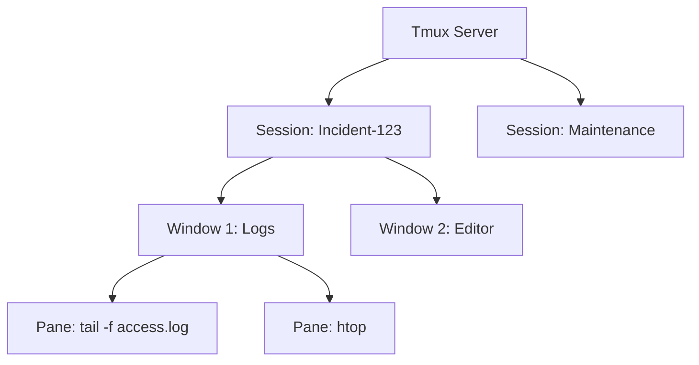

# Terminal Multiplexing with tmux

Your SSH connection just dropped during a long-running database migration. Without a multiplexer, your session is gone, and the process might be in an unknown state. With `tmux`, you just reconnect and pick up exactly where you left off. **This is why `tmux` is a non-negotiable tool for SREs.**

`tmux` (Terminal Multiplexer) lets you manage multiple terminal sessions from a single window. More importantly, it keeps those sessions alive on the server even if your connection breaks.

## Quick Start: The 3-Command Survival Guide

If you're new to `tmux`, these three commands provide 90% of the value:

1.  **Start a session**: `tmux new -s my-work`
2.  **Detach (Leave it running)**: Press `Ctrl+b` then `d`
3.  **Attach (Get back to it)**: `tmux attach -t my-work`

## How Tmux Works

`tmux` sits between your terminal emulator and the shell. It manages a **Server** that hosts multiple **Sessions**. Each session can have multiple **Windows**, and each window can be split into multiple **Panes**.

## The Prefix Key

Most `tmux` commands are triggered by a **Prefix**. By default, this is `Ctrl+b`. You press the prefix, release it, and then press the command key.

-   :material-window-maximize: **Window Management**

    ---

    **Why it matters:** Keep different tasks (logging, editing, monitoring) in separate "tabs" within one SSH session.

    - `Prefix` + `c`: Create a new window
    - `Prefix` + `n` / `p`: Next/Previous window
    - `Prefix` + `0-9`: Jump to specific window

-   :material-columns: **Pane Management**

    ---

    **Why it matters:** Watch logs and run commands side-by-side in the same view.

    - `Prefix` + `"`: Split horizontally
    - `Prefix` + `%`: Split vertically
    - `Prefix` + `Arrow Keys`: Move between panes
    - `Prefix` + `z`: Zoom (maximize) the current pane

-   :material-content-save: **Session Management**

    ---

    **Why it matters:** Persist your work across reboots or connection drops.

    - `tmux ls`: List running sessions
    - `tmux attach`: Reconnect to the last session
    - `Prefix` + `d`: Detach (disconnect without killing)

## Why Tmux Matters for Platform Work

For an SRE, `tmux` is about **resilience and multitasking**.

### Common Scenarios

=== ":material-wifi-off: Connection Resilience"

    When performing risky operations (like upgrading a kernel or migrating a database), always run them inside a `tmux` session. If your VPN drops or your Wi-Fi flutters, the operation continues safely on the server.

=== ":material-monitor-dashboard: Incident War Room"

    Split your screen into four quadrants:
    - **Top Left**: `tail -f` the error logs
    - **Top Right**: `htop` for system resources
    - **Bottom Left**: `kubectl get pods -w`
    - **Bottom Right**: A shell for active troubleshooting

=== ":material-account-group: Shared Troubleshooting"

    Two people can attach to the same `tmux` session on a server. This is a "poor man's screen sharing" that is incredibly effective for remote pair-debugging without any special software.

## Practice Problems

??? question "Practice Problem 1: The Panic Button"

    You're inside `tmux` and everything is frozen. How do you kill the entire session and get back to your normal shell?

    ??? tip "Answer"

        Type `exit` in every pane, or use the command `Prefix` + `:kill-session` followed by `Enter`. If you're completely stuck, you can run `tmux kill-server` from *outside* `tmux` in another terminal.

??? question "Practice Problem 2: Finding Your Way"

    You have 10 windows open in a session and forgot which one has your editor. What's the fastest way to see a list of all windows and pick one?

    ??? tip "Answer"

        Press `Prefix` + `w`. This opens an interactive, searchable list of all windows and panes. You can use the arrow keys to navigate and `Enter` to switch to the selected one.

## Key Takeaways

| Action | Command / Shortcut |
|:-------|:-------------------|
| **Prefix** | `Ctrl+b` (Default) |
| **New Session** | `tmux new -s <name>` |
| **Detach** | `Prefix` + `d` |
| **Attach** | `tmux attach -t <name>` |
| **Split Vertically** | `Prefix` + `%` |
| **Split Horizontally** | `Prefix` + `"` |
| **Zoom Pane** | `Prefix` + `z` |

## Further Reading

### Official Documentation
- [Tmux Wiki](https://github.com/tmux/tmux/wiki) - The official source for documentation and FAQs.
- `man tmux` - The comprehensive manual page.

### Related Tools & Alternatives
- [tmate](https://tmate.io/) - Instant terminal sharing based on tmux.
- [tmux-resurrect](https://github.com/tmux-plugins/tmux-resurrect) - Plugin to persist sessions across system reboots.

### Deep Dives
- [The Tao of Tmux](https://leanpub.com/the-tao-of-tmux/read) - A philosophical and technical deep dive into tmux workflows.
- [Persistent SSH Connections](https://cs.bradpenney.io/building_blocks/computational_thinking/) - Understanding the abstraction of persistent sessions in distributed systems.
