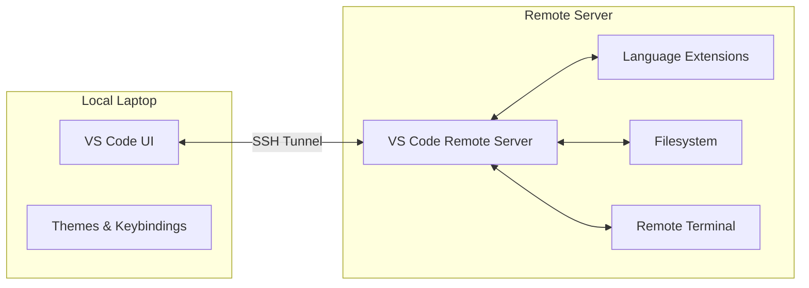

# VS Code Remote: Editing on Servers Without Pain

You're editing a complex Terraform module or a Python script on a remote server. You could use `vim` or `nano` via SSH, but you miss your extensions, your debugger, and your familiar keybindings. **This is why VS Code Remote exists.**

The VS Code Remote - SSH extension lets you use a local VS Code installation to open a folder on a remote machine. It feels exactly like working locally, but the files, the terminal, and the extensions run on the remote server.

## Quick Start: Get Productive in 2 Minutes

1.  **Install the Extension**: Search for "Remote - SSH" in the VS Code Extensions view.
2.  **Connect**: Click the green "Remote Window" button in the bottom-left corner of VS Code.
3.  **Enter Details**: Select "Connect to Host..." and type `user@hostname`.
4.  **Open Folder**: Once connected, go to "File > Open Folder" and browse the remote filesystem.

## How It Works: The Client-Server Model

VS Code splits its architecture. The **Client** (the UI you see) runs on your laptop. The **Server** (the logic, language services, and terminal) is automatically installed and run on the remote machine.

## Why It Matters for Platform Work

SREs often work in environments where data or services are only accessible from within a specific VPC or through a bastion host. VS Code Remote allows you to bring a world-class IDE into those restricted environments.

### Common Scenarios

=== ":material-shield-key: Bastion/Jump Hosts"

    You can configure VS Code to automatically "jump" through a bastion host to reach a private server.
    - Setup your `~/.ssh/config` with `ProxyJump`.
    - VS Code will respect this configuration and connect seamlessly.

=== ":material-python: Remote Debugging"

    Debugging a Python script that fails only on a specific server?
    - Connect via VS Code Remote.
    - Set breakpoints in the editor.
    - Hit `F5`. The debugger runs on the server, but you control it from your laptop.

=== ":material-docker: Inside Containers"

    The same technology allows you to "Remote into" a running Docker container. This is invaluable for inspecting the environment of a failing service or exploring a complex container image.

## Essential Remote Extensions

When working remotely, these extensions run on the *server* and provide massive value:

-   :material-yaml: **YAML / Kubernetes**

    ---

    **Why it matters:** Real-time validation and linting of K8s manifests directly on the server where they'll be applied.

-   :material-terraform: **HashiCorp Terraform**

    ---

    **Why it matters:** Autocomplete for providers and modules, ensuring your IaC changes are syntactically correct before you run `plan`.

-   :material-language-python: **Python (Pylance)**

    ---

    **Why it matters:** Full IntelliSense and type checking for your automation scripts, even when they rely on remote-only libraries.

## Key Takeaways

| Feature | Benefit |
|:--------|:--------|
| **SSH Tunneling** | Secure connection to any server you can SSH into |
| **Local Feel** | Use your favorite themes, fonts, and shortcuts |
| **Remote Terminal** | Integrated terminal runs directly on the server |
| **Port Forwarding** | Access remote web services (like `localhost:8080`) on your local browser |

## Practice Problems

??? question "Practice Problem 1: Port Forwarding"

    You're running a web server on a remote machine on port `8000`. It's not accessible via the public internet. How can VS Code help you see the webpage in your local browser?

    ??? tip "Answer"

        Use **Port Forwarding**. In the "Ports" tab of the integrated terminal, click "Forward a Port" and enter `8000`. VS Code will create a secure tunnel, and you can now visit `http://localhost:8000` on your laptop to see the remote content.

??? question "Practice Problem 2: Extension Installation"

    You installed a "Theme" extension and a "Python" extension while connected to a remote server. Where do these extensions actually live?

    ??? tip "Answer"

        The **Theme** extension lives on your **local laptop** (UI extensions). The **Python** extension (language service) lives on the **remote server** (Workspace extensions). VS Code manages this split automatically.

## Further Reading

### Official Documentation
- [VS Code Remote - SSH Documentation](https://code.visualstudio.com/docs/remote/ssh) - Official guide and troubleshooting.
- [SSH Config File Reference](https://www.ssh.com/ssh/config/) - How to optimize your SSH setup for VS Code.

### Related Tools & Alternatives
- [Tramp (Emacs)](https://www.gnu.org/software/tramp/) - The original remote editing solution.
- [Mosh](https://mosh.org/) - A mobile shell that handles intermittent connectivity better than SSH.

### Deep Dives
- [Client-Server Architecture](https://cs.bradpenney.io/building_blocks/computational_thinking/) - Understanding the separation of concerns in modern development tools.
- [Network Tunneling](https://cs.bradpenney.io/building_blocks/how_parsers_work/) - How SSH tunnels facilitate remote development.
