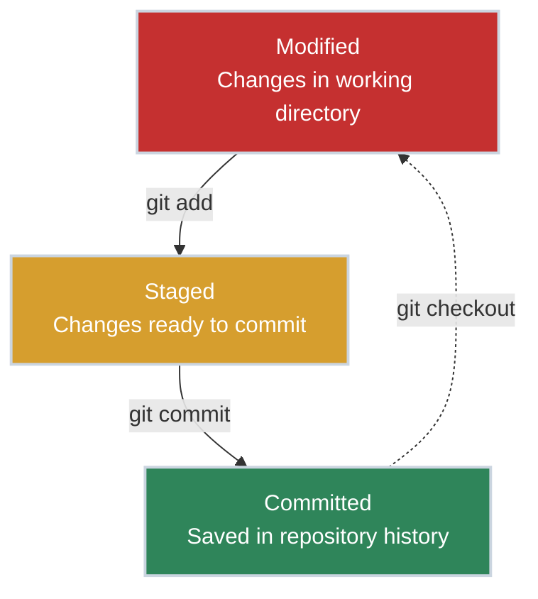

# Git Basics - Your First Repository

!!! tip "Part of Git Essentials Series"
    This is article 1 of the Git Essentials series. After mastering local repositories here, continue to **Git Collaboration** to learn remote repositories and teamwork.

You're managing three versions of the same backup script: `backup.sh`, `backup_v2.sh`, and `backup_FINAL_USE_THIS_ONE.sh`. Last week, someone ran the wrong version in production. You spent an hour figuring out which one was actually deployed. **This is why professional engineers use version control.**

Whether you're writing BASH scripts, Python automation, Perl utilities, or managing infrastructure as code (Terraform, Ansible, Kubernetes manifests), version control is the difference between amateur hour and professional engineering.

## What Git Is (And Why You Need It)

Git is a **distributed version control system**. In plain English: it tracks every change you make to your files, who made it, when, and why. Think of it as an unlimited undo button combined with a time machine for your code.

Under the hood, Git manages these changes as a **Directed Acyclic Graph (DAG)** of commits. Each commit points to its parent(s), creating a verifiable history that never loses data. You can learn more about how [trees and graph structures work](https://cs.bradpenney.io/building_blocks/binary_trees_and_representation/) on our computer science fundamentals site.

**For platform engineers, Git solves real problems:**

- **No more file versioning chaos**: One file, complete history, no `script_v2_final.sh` madness
- **Collaboration without conflicts**: Multiple people can work on the same scripts without overwriting each other
- **Audit trail**: Know exactly who changed what configuration and when (critical for compliance and incident response)
- **Safe experimentation**: Try changes in isolation, roll back if they break production
- **Sharing and backup**: Your code lives on remote servers (GitHub, GitLab), not just your laptop

## Quick Start: Your First Repository

Let's get you productive in 5 minutes. We'll version control a script you're already working on.

### Installation

=== ":material-linux: Linux"

    ```bash title="Install Git on Linux" linenums="1"
    # Debian/Ubuntu
    sudo apt update && sudo apt install git

    # RHEL/Fedora/CentOS
    sudo dnf install git
    ```

=== ":material-apple: macOS"

    ```bash title="Install Git on macOS" linenums="1"
    # Using Homebrew
    brew install git

    # Or use Xcode Command Line Tools
    xcode-select --install
    ```

=== ":material-microsoft-windows: Windows"

    **Choose your approach based on your workflow:**

    === ":material-application-outline: Git for Windows (Recommended)"

        **Best for:** Working primarily on Windows, deploying to Linux servers

        1. Download from [git-scm.com](https://git-scm.com/download/win)
        2. Run the installer with these **critical settings**:

            - **Default editor**: Choose VS Code, Vim, or Nano (NOT Notepad)
            - **PATH environment**: "Git from the command line and also from 3rd-party software"
            - **Line ending conversions**: **"Checkout as-is, commit Unix-style line endings"** (1)
            - **Terminal emulator**: Use MinTTY (Git Bash) or Windows Terminal
            - **Credential helper**: Git Credential Manager (enables GitHub/GitLab auth)

        3. After installation, use **Git Bash** for Unix-like commands or **PowerShell** if you prefer Windows-native tools.

        **Critical post-installation configuration:**

        ```bash title="Configure Line Endings" linenums="1"
        git config --global core.autocrlf input  # (2)!
        ```

        1. **Line ending settings matter!** Windows uses CRLF (`\r\n`), Linux/macOS use LF (`\n`). Wrong settings cause spurious diffs and break shell scripts when deployed to Linux servers. "Checkout as-is, commit Unix-style" ensures scripts work on Linux.
        2. `core.autocrlf input` means: leave files alone when checking out, but convert CRLF to LF when committing. This prevents Windows line endings from breaking scripts on Linux servers.

    === ":material-linux: WSL2 (Linux Subsystem)"

        **Best for:** Managing Linux infrastructure from Windows, need native Linux tools

        ```powershell title="Install WSL2 and Git" linenums="1"
        # In PowerShell (as Administrator)
        wsl --install -d Ubuntu

        # Inside WSL2 Ubuntu terminal
        sudo apt update && sudo apt install git
        ```

        **Why WSL2:**

        - Native Linux Git behavior (no line ending issues)
        - Access to Linux-native tools (`bash`, `ssh`, `grep`, etc.)
        - Same commands as your production Linux servers
        - Can edit files with Windows tools, commit with Linux Git

### Configure Git (One-Time Setup)

Git needs to know who you are so it can attribute changes correctly:

```bash title="Configure Your Identity" linenums="1"
git config --global user.name "Your Name"  # (1)!
git config --global user.email "you@example.com"  # (2)!
```

1. Your name appears in commit history - use your real name for professional work
2. Your email links commits to your GitHub/GitLab account

### Create Your First Repository

Let's version control an existing script:

```bash title="Initialize a Git Repository" linenums="1"
cd ~/scripts  # (1)!
git init  # (2)!
git add backup.sh  # (3)!
git commit -m "Initial commit: backup script v1"  # (4)!
```

1. Navigate to your scripts directory
2. Initialize Git - creates a `.git` folder to track history
3. Stage the file - tell Git you want to track this file
4. Commit - save a snapshot with a descriptive message

**Congratulations!** You just created your first Git repository. Your script is now version controlled.

## Understanding What Just Happened: The Three States

You just ran `git add` and then `git commit`, but **why two commands?** Why not just one "save" command like every other tool you use?

This is where Git is different - and understanding why makes you dangerous (in a good way). Git moves files through **three distinct states**, giving you precise control over what gets saved and when. This isn't complexity for complexity's sake - it's what lets you stage related changes together, review before committing, and maintain a clean history.

**What you just did:**

1. `git add backup.sh` - Moved the file from **Modified** to **Staged** (marked it for inclusion)
2. `git commit` - Moved it from **Staged** to **Committed** (permanently saved in history)

Let's understand these states properly:



<div class="grid cards" markdown>

-   :material-file-edit: **Modified**

    ---

    **What it means:** You've changed a file but haven't told Git about it yet.

    ```bash title="See Modified Files" linenums="1"
    git status  # Shows modified files in red
    ```

    **In your workflow:** You're editing `deploy.sh` and making changes locally.

-   :material-file-check: **Staged**

    ---

    **What it means:** You've marked changes to be included in the next commit.

    ```bash title="Stage Files" linenums="1"
    git add deploy.sh  # Stage specific file
    git add .  # Stage all changes (use carefully!)
    ```

    **In your workflow:** You've finished editing and you're ready to save a snapshot.

-   :material-lock: **Committed**

    ---

    **What it means:** Changes are permanently saved in Git's history.

    ```bash title="Commit Changes" linenums="1"
    git commit -m "Add error handling to deploy script"
    ```

    **In your workflow:** This version is saved forever. You can always return to it.

</div>

## Common Scenarios for Platform Engineers

Let's walk through real situations you'll encounter daily.

=== ":material-script-text: Tracking Script Changes"

    You maintain a collection of operational scripts. Version control them properly:

    ```bash title="Version Control Your Scripts" linenums="1"
    cd ~/ops-scripts
    git init

    # Add scripts one at a time (safer than git add .)
    git add backup.sh
    git add deploy.sh
    git add cleanup.sh

    git commit -m "Initial commit: core ops scripts"
    ```

    **Why per-file staging matters:** You might have test files, credentials, or temporary scripts you don't want to commit.

=== ":material-undo: Undoing Mistakes"

    You made changes and broke the script. Git provides safety nets:

    ```bash title="Undo Commands" linenums="1"
    # Discard local changes (before staging)
    git restore backup.sh  # (1)!

    # Unstage a file (oops, didn't mean to add that!)
    git restore --staged secret.env  # (2)!

    # Change the last commit message
    git commit --amend -m "Better message"  # (3)!

    # Undo the last commit but keep changes
    git reset --soft HEAD~1  # (4)!
    ```

    1. Throw away local edits, go back to last committed version
    2. Remove file from staging area but keep your local changes
    3. Modify the most recent commit (message or add more files)
    4. Uncommit but keep files in staging area - useful if you committed too early

=== ":material-timeline-text: Viewing History"

    Who changed the firewall rules last Tuesday? Git knows:

    ```bash title="Investigate History" linenums="1"
    # See recent commits
    git log  # (1)!

    # See what changed in each commit
    git log -p  # (2)!

    # See who wrote each line of a file
    git blame firewall-rules.sh  # (3)!

    # Search commit messages
    git log --grep="firewall"  # (4)!
    ```

    1. Shows commit history with messages, authors, dates
    2. Shows actual code changes in each commit
    3. Line-by-line attribution - most useful when working with teammates (we'll cover this more in [Git Collaboration](git_collaboration.md))
    4. Find commits mentioning "firewall" - great for incident investigation

## Avoiding Common Pitfalls

<div class="grid cards" markdown>

-   :material-shield-alert: **Never Commit Secrets**

    ---

    **The problem:** Credentials, API keys, and passwords in Git history are a security nightmare.

    **The solution:** Use `.gitignore` to prevent secret files from being tracked.

    ```text title="Add to .gitignore" linenums="1"
    # Secrets and credentials
    .env
    *.pem
    *.key
    credentials.json
    config/secrets.yml
    ```

    **Why this matters:** Once committed, secrets are in history forever (even if you delete the file later). Use `.gitignore` BEFORE you commit.

-   :material-message-text: **Write Meaningful Commit Messages**

    ---

    **The problem:** "Fixed stuff" doesn't help anyone (including future you).

    ```text title="Good Commit Message Example"
    feat: add retry logic to backup script

    Added 3 retry attempts with exponential backoff
    when S3 upload fails. Prevents backup failures
    during temporary network issues.

    Resolves ticket OPS-1234
    ```

    **The format:** First line = summary (50 chars max). Body = why you made this change.

-   :material-folder-alert: **Use .gitignore Strategically**

    ---

    **The problem:** You don't want temporary files, logs, or build artifacts in version control.

    ```text title=".gitignore Example" linenums="1"
    # Python
    __pycache__/
    *.pyc
    .venv/

    # Terraform
    .terraform/
    *.tfstate
    *.tfstate.backup

    # Secrets
    .env
    *.pem
    credentials.json

    # Logs
    *.log
    ```

    **Key insight:** If it's generated, temporary, or secret, it doesn't belong in Git.

</div>

## What's Next: Collaborating with Git

You now know how to manage a **local** Git repository - tracking changes, viewing history, and undoing mistakes. But professional platform engineering is a team sport.

**Continue to [Git Collaboration](git_collaboration.md)** to learn:

- Remote repositories (GitHub, GitLab)
- Clone, pull, push workflows
- Daily team collaboration
- Handling basic conflicts

## Practice Problems

??? question "Practice Problem 1: Undoing Staged Changes"

    You accidentally ran `git add .` and included a file named `database_password.txt`. The file is now staged. How do you remove it from the staging area WITHOUT deleting the file from your disk?

    ??? tip "Answer"

        ```bash
        git restore --staged database_password.txt
        ```

        This moves the file from **Staged** back to **Modified** state. The file remains on disk, but Git won't include it in the next commit. You should immediately add it to `.gitignore`.

??? question "Practice Problem 2: Viewing History"

    Someone changed the backup script last week and it's been failing ever since. How do you find out who changed it and what they modified?

    ??? tip "Answer"

        ```bash
        # See recent commits for this file
        git log backup.sh

        # See the actual changes
        git log -p backup.sh

        # See line-by-line attribution
        git blame backup.sh
        ```

        `git log` shows who committed what and when. `git log -p` shows the actual code changes. `git blame` shows who wrote each line currently in the file (most useful for team collaboration - covered in detail in [Git Collaboration](git_collaboration.md)).

??? question "Practice Problem 3: Undoing a Committed Change"

    You committed a change to `cleanup.sh`, but it's causing problems. You haven't pushed it yet. How do you undo the commit but keep your file changes so you can fix them?

    ??? tip "Answer"

        ```bash
        git reset --soft HEAD~1
        ```

        This undoes the most recent commit but leaves your changes in the staging area. You can now edit the file, fix the problem, and commit again. Use `--soft` to keep changes staged, or `--mixed` to unstage them (but still keep file changes).

## Key Takeaways

| Concept | What It Means | Why It Matters |
|:--------|:--------------|:---------------|
| **Repository** | A project tracked by Git (the `.git` folder) | Your scripts/configs have complete history |
| **Modified** | Changed files in working directory | Unsaved edits - you're still working |
| **Staged** | Files marked for the next commit | Precise control over what gets saved |
| **Committed** | Permanently saved in Git history | Safe snapshot you can always return to |
| **Remote** | Repository on GitHub/GitLab/etc | Collaboration and backup |
| **Clone** | Download a repository copy | Get teammates' code with full history |
| **Pull** | Get latest changes from remote | Stay in sync with team |
| **Push** | Send your commits to remote | Share your work with team |

## Quick Reference

```bash title="Essential Git Commands" linenums="1"
# Setup
git config --global user.name "Name"
git config --global user.email "email"

# Start tracking
git init                          # Create new repository
git clone <url>                   # Copy existing repository

# Daily workflow
git status                        # See what's changed
git diff                          # See changes in detail
git add <file>                    # Stage changes
git commit -m "message"           # Save snapshot
git log                           # View history

# Undo mistakes
git restore <file>                # Discard local changes
git restore --staged <file>       # Unstage
git commit --amend                # Fix last commit
git reset --soft HEAD~1           # Undo last commit, keep changes

# Collaboration
git pull origin main              # Get latest changes
git push origin main              # Share your changes
git remote -v                     # See remote repositories
```

## Further Reading

### Official Documentation
- [Pro Git Book](https://git-scm.com/book/en/v2) - The comprehensive Git reference, free online
- [Git Documentation](https://git-scm.com/doc) - Official docs and command reference

### Related Tools & Workflows
- [GitHub Flow](https://docs.github.com/en/get-started/quickstart/github-flow) - Simple branch-based workflow for teams
- [Pre-commit Hooks](https://pre-commit.com/) - Automate checks before commits (linting, security scans)

### Deep Dives
- **Git Workflows** (coming soon in the Efficiency series) - Feature branches, pull requests, conflict resolution
- **Git Internals** (coming soon in the Mastery series) - How Git actually works under the hood

### Platform Engineering Context
- [Infrastructure as Code Best Practices](https://www.terraform.io/docs/cloud/guides/recommended-practices/index.html) - Why version control matters for IaC
- [The Twelve-Factor App](https://12factor.net/) - Modern app/platform engineering principles (includes version control)

---

**What's Next:** Once you're comfortable with basic Git, continue to [Git Collaboration](git_collaboration.md) to learn how to work with remote repositories, sync with your team, and use branch-based workflows professionally.
