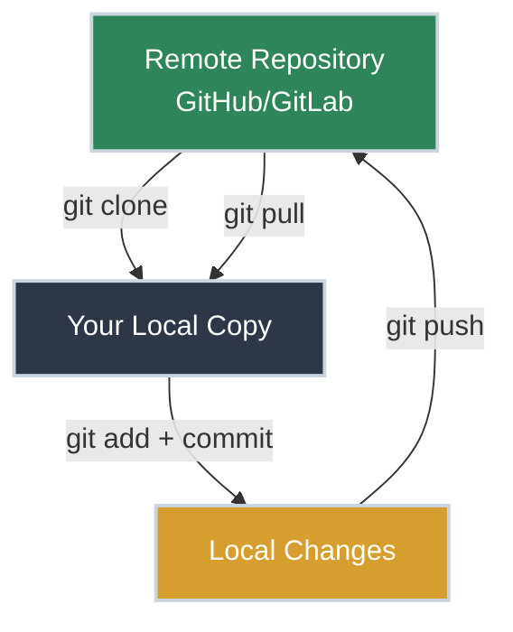
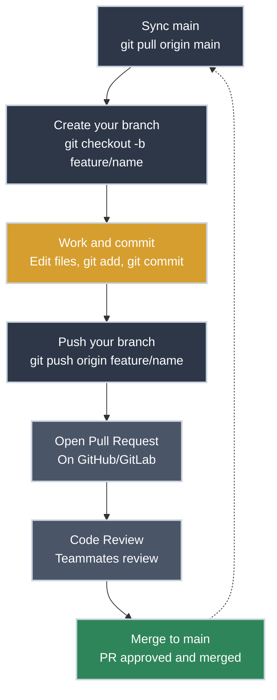

# Git Collaboration - Working with Remote Repositories

!!! tip "Part of Git Essentials Series"
    This is article 2 of the Git Essentials series. If you haven't mastered local repositories yet, start with [Git Basics](./git_basics.md) first.

Your teammate just shared a repository link: "Here's the monitoring scripts repo - clone it and add your disk space check." You stare at the URL. **Clone? Where does the code even go? How do you get your changes back to the team?**

This is the reality of professional platform engineering - your scripts and infrastructure code live on shared repositories (GitHub, GitLab, Bitbucket), not just your laptop. Collaboration isn't optional; it's how the job works.

## What Are Remote Repositories?

A **remote repository** is a version of your project hosted on a server (GitHub, GitLab, your company's Git server). Think of it as the "source of truth" that your team syncs with.

**Why remote repositories matter for platform engineers:**

- **Collaboration** - Multiple people can work on the same scripts/infrastructure code
- **Backup** - Your code exists on a server, not just your laptop
- **Code review** - Teammates can review changes before they go to production
- **CI/CD integration** - Automated testing and deployment when you push code
- **Audit trail** - Complete history of who changed what and when

**The workflow:**



## Getting Started: Two Common Scenarios

Platform engineers encounter two main scenarios with remote repositories:

=== ":material-download: Joining an Existing Project"

    **The situation:** Your team already has a repository with scripts/configs. You need to get the code and start contributing.

    **What you do:** Clone the repository to get a local copy.

    ```bash title="Clone an Existing Repository" linenums="1"
    git clone git@github.com:company/ops-scripts.git  # (1)!
    cd ops-scripts  # (2)!
    ls -la  # (3)!
    ```

    1. Downloads the entire repository including all history
    2. Navigate into the cloned directory
    3. See all the files - you now have a complete working copy

    **Key insight:** `clone` creates a new directory with the repository name. You get everything: files, history, branches.

=== ":material-upload: Sharing Your Own Scripts"

    **The situation:** You've been working on scripts locally (using Git Basics). Now you want to share them with your team.

    **What you do:** Create a remote repository and push your local work to it.

    ```bash title="Push Local Repository to Remote" linenums="1"
    # (After creating repo on GitHub/GitLab)
    git remote add origin git@github.com:you/monitoring-scripts.git  # (1)!
    git branch -M main  # (2)!
    git push -u origin main  # (3)!
    ```

    1. Link your local repo to the remote repository
    2. Ensure your branch is named "main" (modern convention)
    3. Push your code and set upstream tracking (initial push only - see warning below)

    !!! warning "After This Initial Push"
        This is a one-time setup to get your code on the remote. Once teammates join, **always work on branches** and use pull requests to merge to `main`. See the Daily Collaboration Workflow section below.

## Understanding Clone, Pull, and Push

Three commands control collaboration:

| Command | Direction | What It Does | When You Use It |
|:--------|:---------:|:-------------|:----------------|
| **`git clone`** | Remote → Local | Downloads entire repository for first time | Joining a new project |
| **`git pull`** | Remote → Local | Updates your local copy with team's changes | Morning sync, before starting work |
| **`git push`** | Local → Remote | Sends your commits to the remote | Sharing your completed work |

## Setting Up Remote Repositories

=== ":material-github: GitHub"

    **Step 1: Create repository on GitHub**

    1. Go to [github.com](https://github.com) and click "New repository"
    2. Name it (e.g., `ops-scripts`)
    3. Choose public or private
    4. **Don't** initialize with README (you already have local commits)
    5. Click "Create repository"

    **Step 2: Link your local repository**

    ```bash title="Connect to GitHub" linenums="1"
    git remote add origin git@github.com:username/ops-scripts.git
    git push -u origin main
    ```

    **SSH vs HTTPS:** Use SSH URLs (`git@github.com:...`) for passwordless authentication with SSH keys. HTTPS URLs require credentials every push.

=== ":material-gitlab: GitLab"

    **Step 1: Create project on GitLab**

    1. Go to [gitlab.com](https://gitlab.com) and click "New project"
    2. Choose "Create blank project"
    3. Name it and set visibility (public/private)
    4. **Uncheck** "Initialize repository with a README"
    5. Click "Create project"

    **Step 2: Link your local repository**

    ```bash title="Connect to GitLab" linenums="1"
    git remote add origin git@gitlab.com:username/ops-scripts.git
    git push -u origin main
    ```

=== ":material-server: Company Git Server"

    **Your company likely has:**

    - GitHub Enterprise (self-hosted GitHub)
    - Self-hosted GitLab
    - Bitbucket Server
    - Azure DevOps Repos
    - AWS CodeCommit

    **The process is the same:**

    ```bash title="Connect to Company Git Server" linenums="1"
    # GitHub Enterprise
    git remote add origin git@github.company.com:team/ops-scripts.git

    # Or other company Git server
    git remote add origin git@git.company.com:team/ops-scripts.git

    git push -u origin main
    ```

    **Ask your team:** What's the Git server URL? Do you need VPN access? Are there naming conventions?

## Daily Collaboration Workflow

Professional collaboration with Git follows a rhythm: **sync main, create branch, work, commit, push branch**. Here's the visual workflow:



!!! warning "Never Commit Directly to Main"
    In professional environments, `main` is protected. You work on your own branch and merge to `main` via pull requests (covered in **Git Workflows** - coming soon). Direct commits to `main` are bad practice.

### Morning: Start with a Clean Sync

Before you touch any code, get the latest changes from your team and create a branch for your work.

```bash title="Morning: Sync and Create Branch" linenums="1"
cd ~/ops-scripts
git checkout main  # (1)!
git pull origin main  # (2)!
git checkout -b feature/disk-monitoring  # (3)!
```

1. Switch to main branch
2. Get latest changes from the team
3. Create a new branch for your work (branch names often use `feature/`, `fix/`, or `chore/` prefixes)

**What happens:** Git fetches commits from the remote and automatically merges them into your local branch. If there are no conflicts, you're ready to work. If there are conflicts, Git will tell you which files need manual resolution.

**Output you'll see:**

```text
remote: Counting objects: 5, done.
remote: Compressing objects: 100% (3/3), done.
Unpacking objects: 100% (5/5), done.
From github.com:company/ops-scripts
   abc1234..def5678  main       -> origin/main
Updating abc1234..def5678
Fast-forward
 backup.sh | 10 +++++-----
 1 file changed, 5 insertions(+), 5 deletions(-)
```

This tells you your teammate modified `backup.sh` with 5 changes.

### During the Day: Work on Your Branch

Now you can work on your changes. You're on your own branch (`feature/disk-monitoring`), so you can commit freely without affecting the team's `main` branch.

```bash title="During the Day: Make Changes" linenums="1"
# Verify you're on your branch
git branch  # (1)!

# Work on your script
vim disk_monitor.sh

# Review, stage, and commit (same workflow as Git Basics)
git status  # (2)!
git diff disk_monitor.sh
git add disk_monitor.sh
git commit -m "Add disk space monitoring with 80% threshold alert"
```

1. Shows which branch you're on (should show `* feature/disk-monitoring`)
2. Use the same review workflow from [Git Basics](git_basics.md) - status, diff, add, commit

**Pro tip for teams:** Commit more frequently than you would solo. Small, focused commits ("Add monitoring function" → "Add threshold logic" → "Add alerts") are easier for teammates to review than one giant "Add disk monitoring" commit.

### End of Day: Push Your Branch

When you're ready to share your work, push your branch to the remote repository. Your teammates can then review it via a pull request before it gets merged to `main`.

```bash title="End of Day: Push Your Branch" linenums="1"
git push -u origin feature/disk-monitoring  # (1)!
```

1. Pushes your branch to the remote repository; `-u` sets up tracking so future pushes can use just `git push`

**What happens next:** After pushing your branch:

1. Open a pull request on GitHub/GitLab/etc.
2. Teammates review your code
3. Once approved, the PR gets merged to `main`
4. You delete your branch and start a new one for the next task

**We'll cover pull requests in detail in **Git Workflows** (coming soon) - for now, just know that pushing your branch is the first step toward getting your code into `main`.

### The Complete Daily Rhythm

Here's the full workflow on one screen:

```bash title="Full Daily Git Workflow (Branch-Based)" linenums="1"
# Morning: Sync main and create your branch
git checkout main
git pull origin main
git checkout -b feature/my-feature

# During the day: Work and commit (repeat as needed)
vim script.sh
git add script.sh
git commit -m "Clear description of what changed"

# Before lunch/breaks: Push your branch (backup your work)
git push -u origin feature/my-feature

# End of day: Push your branch
git push origin feature/my-feature
# Then open a pull request on GitHub/GitLab
```

**Key habits:**

- **Always work on a branch** - Never commit directly to `main`
- **Sync main before creating branch** - Start with the latest code
- **Commit often** - Small, focused commits are better
- **Push your branch regularly** - Backs up your work to the remote
- **Clear commit messages** - Your teammates (and future you) will thank you
- **Use pull requests to merge to main** - Covered in **Git Workflows** (coming soon)

## Common Collaboration Patterns

=== ":material-clock-outline: The Morning Sync"

    **Start every day with `git pull`:**

    ```bash title="Daily Standup Routine" linenums="1"
    cd ~/infrastructure-repo
    git pull origin main
    # Now you have the latest changes from overnight/other time zones
    ```

    **Why this matters:** Prevents working on outdated code. You'll know immediately if teammates changed files you're planning to edit.

=== ":material-account-multiple: Checking Who Changed What"

    **Someone broke the deployment script. Who was it?** Use the `git log` and `git blame` commands from [Git Basics](git_basics.md), but now for team investigation:

    ```bash title="Investigate Team Changes" linenums="1"
    git log --oneline -5           # Last 5 commits from anyone on the team
    git log --author="jane"        # Filter by teammate
    git blame deploy.sh            # Who wrote each line currently in the file
    ```

=== ":material-sync: Checking Remote Status"

    **Am I ahead or behind the team?**

    ```bash title="Check Sync Status" linenums="1"
    git fetch origin  # (1)!
    git status  # (2)!
    ```

    1. Updates remote tracking info (doesn't change your files)
    2. Shows if you're ahead/behind/diverged from origin/main

    **Example output:**
    ```text
    Your branch is ahead of 'origin/main' by 2 commits.
      (use "git push" to publish your local commits)
    ```

=== ":material-download-outline: Getting Specific Versions"

    **Need the version from last week for rollback?**

    ```bash title="View and Checkout Old Versions" linenums="1"
    git log --oneline  # (1)!
    git checkout abc1234 -- deploy.sh  # (2)!
    git diff deploy.sh  # (3)!
    ```

    1. Find the commit hash from last week
    2. Get that specific version of the file
    3. See what changed between then and now

## Understanding Remote Tracking

When you clone or push with `-u`, Git sets up **remote tracking**:

```bash title="See Remote Configuration" linenums="1"
git remote -v  # (1)!
# origin  git@github.com:company/ops-scripts.git (fetch)
# origin  git@github.com:company/ops-scripts.git (push)

git branch -vv  # (2)!
# * main abc1234 [origin/main] Add monitoring script
```

1. Shows all remote repositories linked to your local repo
2. Shows which remote branch your local branch tracks

**What `-u` does in `git push -u origin main`:**

- Sets `origin/main` as the "upstream" for your local `main` branch
- After this, you can use just `git push` instead of `git push origin main`
- Git knows where to push and pull from automatically

## Avoiding Common Mistakes

<div class="grid cards" markdown>

-   :material-alert: **Don't Push Broken Code**

    ---

    **The problem:** Pushing code that doesn't work breaks your teammates' environments.

    **The solution:** Test locally before pushing.

    ```bash title="Pre-Push Checklist" linenums="1"
    # Run your script locally
    ./monitoring.sh

    # Check syntax if it's code
    python -m py_compile script.py  # Python
    bash -n script.sh  # Bash

    # Then push
    git push origin main
    ```

-   :material-lock-alert: **Don't Push Secrets**

    ---

    **Setup:** [Git Basics covers .gitignore configuration](git_basics.md#avoiding-common-pitfalls) - set that up BEFORE pushing.

    **Pre-push check:** Once you're collaborating with a team, add this to your routine:

    ```bash title="Pre-Push Secret Check" linenums="1"
    git diff origin/main..HEAD  # What am I about to push?
    grep -r "password\|secret\|key" .  # Scan for secrets
    ```

    **If you accidentally pushed secrets:** Rotate the credentials immediately. Once in remote history, deletion doesn't help - teammates already pulled it.

-   :material-arrow-u-down-left: **Always Pull Before Push**

    ---

    **The problem:** If you push without pulling first and teammates changed the same files, you'll get rejected.

    **Error you'll see:**
    ```text
    ! [rejected]        main -> main (non-fast-forward)
    error: failed to push some refs
    ```

    **The fix:**
    ```bash title="Sync Before Pushing" linenums="1"
    git pull origin main  # Get teammate changes
    # Resolve any conflicts if needed
    git push origin main  # Now push works
    ```

</div>

## When Things Go Wrong

**Scenario: "I pulled and now there are conflicts"**

You'll see:
```text
Auto-merging monitoring.sh
CONFLICT (content): Merge conflict in monitoring.sh
Automatic merge failed; fix conflicts and then commit the result.
```

**What this means:** You and a teammate changed the same lines. Git can't automatically merge. This conflict often happens when multiple changes occur at the same level of Git's internal [tree structure](https://cs.bradpenney.io/building_blocks/binary_trees_and_representation/).

**Quick resolution (we'll cover this deeply in Git Efficiency):**

1. Open the file - Git marks conflicts with `<<<<<<<`, `=======`, `>>>>>>>`
2. Edit to keep the correct version (yours, theirs, or combination)
3. Remove the conflict markers
4. `git add monitoring.sh`
5. `git commit -m "Merge remote changes"`
6. `git push origin main`

**Scenario: "I pushed and realized I made a mistake"**

**Option 1: Fix it with a new commit** (recommended)
```bash
# Fix the mistake
vim monitoring.sh
git add monitoring.sh
git commit -m "Fix threshold logic in monitoring script"
git push origin main
```

**Option 2: Revert the commit** (creates inverse commit)
```bash
git log --oneline  # Find the bad commit hash
git revert abc1234  # Creates new commit that undoes it
git push origin main
```

**Don't use `git push --force`** - This can overwrite teammates' work. Only force-push if you absolutely know what you're doing and have coordinated with your team.

## Practice Problems

??? question "Practice Problem 1: Cloning and Exploring"

    You're joining a new team. They gave you the repository URL: `git@github.com:company/ansible-playbooks.git`

    Tasks:
    1. Clone the repository
    2. List all files
    3. See the last 5 commits
    4. Find out who last modified `webserver.yml`

    ??? tip "Solution"

        ```bash title="Clone and Explore Repository" linenums="1"
        # Clone the repo
        git clone git@github.com:company/ansible-playbooks.git
        cd ansible-playbooks

        # List all files
        ls -la

        # See last 5 commits
        git log --oneline -5

        # Find who last modified webserver.yml
        git log -1 webserver.yml
        # Or see line-by-line attribution:
        git blame webserver.yml
        ```

??? question "Practice Problem 2: Daily Workflow"

    You're working on a script called `backup.sh`. Your teammate just told you they pushed changes to `main` this morning.

    Tasks:
    1. Sync main with the latest changes
    2. Create a branch for your work
    3. Make your changes to the file
    4. Commit and push your branch

    ??? tip "Solution"

        ```bash title="Branch-Based Workflow" linenums="1"
        # Sync main with teammate's changes
        git checkout main
        git pull origin main

        # Create your branch
        git checkout -b fix/backup-error-handling

        # Make your changes
        vim backup.sh

        # Check what you changed
        git status
        git diff backup.sh

        # Commit your changes to your branch
        git add backup.sh
        git commit -m "Add error handling for S3 upload failures"

        # Push your branch
        git push -u origin fix/backup-error-handling
        # Next: Open a pull request to merge to main
        ```

??? question "Practice Problem 3: Checking Remote Status"

    You've made 3 local commits but haven't pushed yet. You want to know:
    1. Are you ahead or behind the remote?
    2. What commits haven't been pushed yet?

    ??? tip "Solution"

        ```bash title="Check Remote Status" linenums="1"
        # Update remote tracking information
        git fetch origin

        # Check status
        git status
        # Output: "Your branch is ahead of 'origin/main' by 3 commits"

        # See which commits haven't been pushed
        git log origin/main..HEAD
        # Shows your 3 local commits that aren't on the remote yet
        ```

## Key Takeaways

| Concept | Command | When to Use |
|:--------|:--------|:------------|
| **Clone** | `git clone <url>` | First time getting a repository |
| **Branch** | `git checkout -b feature/name` | Create branch for your work |
| **Pull** | `git pull origin main` | Sync main with team's latest changes |
| **Push** | `git push origin feature/name` | Share your branch with team |
| **Remote** | `git remote -v` | See configured remote repositories |
| **Fetch** | `git fetch origin` | Update remote tracking (doesn't change files) |
| **Status** | `git status` | Check if ahead/behind remote |

## Quick Reference

```bash title="Essential Collaboration Commands" linenums="1"
# Getting started
git clone <url>                   # Get a repository for first time
git remote -v                     # See remote repositories

# Daily workflow (branch-based)
git checkout main                 # Switch to main
git pull origin main              # Get latest from team
git checkout -b feature/my-work   # Create your branch
git push -u origin feature/my-work # Push your branch
git fetch origin                  # Update remote info only

# Checking status
git status                        # Am I ahead/behind?
git branch                        # Which branch am I on?
git log origin/main..HEAD         # What haven't I pushed?

# Setting up remotes (initial setup only)
git remote add origin <url>       # Link to remote repository
git push -u origin main           # Initial push (then switch to branches)
```

## Further Reading

### Official Documentation
- [Pro Git: Working with Remotes](https://git-scm.com/book/en/v2/Git-Basics-Working-with-Remotes) - Comprehensive guide to remote repositories
- [GitHub Docs: Getting Started](https://docs.github.com/en/get-started) - GitHub-specific workflows

### Platform-Specific Guides
- [GitHub Flow](https://docs.github.com/en/get-started/quickstart/github-flow) - Simple branch-based workflow
- [GitLab Flow](https://docs.gitlab.com/ee/topics/gitlab_flow.html) - GitLab's recommended workflow
- [Atlassian Git Tutorials](https://www.atlassian.com/git/tutorials/syncing) - Excellent collaboration guides

### Team Collaboration
- **Git Workflows** (coming soon) - Advanced collaboration patterns (feature branches, pull requests)
- [Code Review Best Practices](https://google.github.io/eng-practices/review/) - Google's code review guide

### Troubleshooting
- [Oh Shit, Git!?!](https://ohshitgit.com/) - Common Git mistakes and how to fix them
- [Git Flight Rules](https://github.com/k88hudson/git-flight-rules) - What to do when things go wrong

---

**What's Next:** You now know how to collaborate with Git. For advanced workflows like feature branches, pull requests, and conflict resolution, continue to **Git Workflows** (coming soon).
