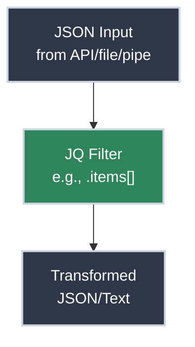

# JQ: Parsing API Responses and Logs

<!-- PATHWAY_ROADMAP:START -->
<div class="pathway-pills" markdown>
:material-map-marker-path: <span class="pathway-pills__label">Part of a pathway:</span> [Debugging With Nothing But a Terminal](https://bradpenney.io/pathways/nothing-but-a-terminal){: .pathway-pill }
</div>

??? abstract ":material-map-legend: Consult the map"

    <div class="grid cards" markdown>

    -   :material-console: __Debugging With Nothing But a Terminal__ — step 9 of 20

        ---

        ← [How Parsers Work](https://cs.bradpenney.io/efficiency/how_parsers_work/) · **you are here** · [Working with YAML](https://python.bradpenney.io/essentials/yaml/) →

        [Start the pathway →](https://bradpenney.io/pathways/nothing-but-a-terminal)

    </div>
<!-- PATHWAY_ROADMAP:END -->

It's 2am. The API is returning errors. You SSH into the server, `curl` the endpoint, and get back 500 lines of JSON. You squint at the terminal trying to find the error message buried somewhere in that wall of text. **This is why `jq` exists.**

`jq` is a lightweight and flexible command-line JSON processor. It's like `sed`, `awk`, and `grep` specifically designed for JSON data. For SREs and Platform Engineers, `jq` is an essential tool for parsing API responses, filtering logs, and transforming data during incident response and automation.

## Installation

Before you can use `jq`, you need to install it:

=== ":material-linux: Linux"

    ```bash title="Install JQ on Linux" linenums="1"
    # Debian/Ubuntu
    sudo apt-get update && sudo apt-get install jq

    # RHEL/CentOS/Fedora
    sudo dnf install jq

    # Arch Linux
    sudo pacman -S jq
    ```

=== ":material-apple: macOS"

    ```bash title="Install JQ on macOS" linenums="1"
    # Using Homebrew
    brew install jq

    # Using MacPorts
    sudo port install jq
    ```

=== ":material-microsoft-windows: Windows"

    ```bash title="Install JQ on Windows" linenums="1"
    # Using Chocolatey
    choco install jq

    # Using Scoop
    scoop install jq

    # Or download binary from https://jqlang.github.io/jq/download/
    ```

Verify installation:

```bash title="Check JQ Version" linenums="1"
jq --version
# Output: jq-1.7.1 (or similar)
```

## Quick Start: Get Productive in 5 Minutes

You can start using `jq` immediately with these essential patterns.

```bash title="Common JQ Operations" linenums="1"
# Pretty-print JSON
curl -s https://api.github.com/repos/stedolan/jq | jq '.'

# Extract a specific field
curl -s https://api.github.com/repos/stedolan/jq | jq '.description'

# Extract multiple fields into a new object
curl -s https://api.github.com/repos/stedolan/jq | jq '{name: .name, stars: .stargazers_count}'

# Filter an array
cat pods.json | jq '.items[] | select(.status.phase == "Running") | .metadata.name'
```


## How JQ Works

`jq` operates on a stream of JSON entities. It takes an input, applies a **filter**, and sends the result to standard output.



Three filters cover most of what you'll type in your first week with `jq`:

<div class="grid cards" markdown>

-   :material-filter: **The Identity Filter (`.`)**

    ---

    **Why it matters:** The simplest filter. It takes the input and outputs it exactly as is, but pretty-printed by default.

    ``` bash title="Pretty Print" linenums="1"
    echo '{"foo": "bar"}' | jq '.'
    ```

    **Key insight:** Use this as your "first pass" to understand the structure of unknown JSON.

-   :material-magnify: **Object Identifier (`.foo`)**

    ---

    **Why it matters:** Extracts the value associated with a key.

    ``` bash title="Extract Field" linenums="1"
    echo '{"status": "ok"}' | jq '.status'
    ```

    **Key insight:** You can chain these for nested data: `.metadata.name`.

-   :material-format-list-bulleted: **Array Iterator (`.[]`)**

    ---

    **Why it matters:** "Unpacks" an array, outputting each element individually.

    ``` bash title="Iterate Array" linenums="1"
    echo '[1, 2, 3]' | jq '.[]'
    ```

    **Key insight:** Essential for processing lists of pods, nodes, or log entries.

</div>

## Why JQ Matters for Platform Work

In a world where everything is an API, JSON is the universal language. Whether you're debugging Kubernetes manifests, parsing CloudTrail logs, or interacting with a proprietary internal service, `jq` lets you cut through the noise.

### Common Scenarios

=== ":material-kubernetes: Kubernetes Debugging"

    Extract all pod names and their statuses from a namespace:

    ```bash title="List Pod Statuses" linenums="1"
    kubectl get pods -o json | jq '.items[] | {name: .metadata.name, status: .status.phase}'
    ```

=== ":material-cloud: Cloud API Parsing"

    Find the Instance ID of all running EC2 instances with a specific tag:

    ```bash title="Filter AWS Instances" linenums="1"
    aws ec2 describe-instances --output json | jq '.Reservations[].Instances[] | select(.State.Name=="running") | .InstanceId'
    ```

=== ":material-text-box-search: Log Analysis"

    Parse structured JSON logs to find high-latency requests:

    ```bash title="Find Slow Requests" linenums="1"
    cat access.log | jq 'select(.latency_ms > 500) | {timestamp, path, latency: .latency_ms}'
    ```

## Common Pitfalls

Even experienced users hit these `jq` gotchas:

<div class="grid cards" markdown>

-   :material-alert-circle: **Forgetting to Quote the Filter**

    ---

    Your shell tries to expand `[]` and `{}` as glob patterns before `jq` ever sees them. Quote the filter and the shell leaves it alone:

    ```bash title="Wrong - Shell Interprets Braces" linenums="1"
    jq .items[] data.json  # ❌ Shell sees [] as glob pattern
    ```

    ```bash title="Correct - Always Quote" linenums="1"
    jq '.items[]' data.json  # ✅ Filter passed to jq correctly
    ```

-   :material-alert-circle: **Pipe Confusion**

    ---

    `jq` uses `|` for its own pipeline. Don't confuse it with shell pipes:

    ```bash title="JQ Pipe (Inside Filter)" linenums="1"
    jq '.items[] | select(.status == "active")' data.json
    ```

    ```bash title="Shell Pipe (Between Commands)" linenums="1"
    curl api.example.com | jq '.items[]'
    ```

-   :material-alert-circle: **Array vs Array Elements**

    ---

    `.items` returns the whole array. `.items[]` iterates elements:

    ```bash title="Understand the Difference" linenums="1"
    echo '{"items":[1,2,3]}' | jq '.items'    # [1,2,3]
    echo '{"items":[1,2,3]}' | jq '.items[]'  # 1\n2\n3
    ```

</div>

## Practice Problems

??? question "Practice Problem 1: Extracting from Arrays"

    Given the JSON `{"users": [{"id": 1, "name": "Alice"}, {"id": 2, "name": "Bob"}]}`, how would you extract just the names of all users?

    ??? tip "Answer"

        ```bash title="Extract Names from an Array of Objects" linenums="1"
        echo '{"users": [{"id": 1, "name": "Alice"}, {"id": 2, "name": "Bob"}]}' | jq '.users[].name'
        ```
        The `.users` part gets the array, `[]` iterates over its elements, and `.name` extracts the field from each element.

??? question "Practice Problem 2: Filtering"

    How would you filter a list of numbers `[10, 25, 5, 40]` to only show those greater than 20?

    ??? tip "Answer"

        ```bash title="Filter Numbers Greater Than 20" linenums="1"
        echo '[10, 25, 5, 40]' | jq '.[] | select(. > 20)'
        ```
        `select()` is a powerful built-in function that keeps only the elements for which the expression inside is true.

## Key Takeaways

| Filter | Description |
|:-------|:------------|
| `.` | The identity filter (pretty-prints input) |
| `.foo` | Extract field "foo" from an object |
| `.[]` | Iterate over elements in an array |
| `select(condition)` | Keep only elements matching the condition |
| <code>&#124;</code> | Pipe the output of one filter into the next |

## What's Next

If you're following the [Debugging With Nothing But a Terminal](https://bradpenney.io/pathways/nothing-but-a-terminal) pathway, the next step is **[Working with YAML](https://python.bradpenney.io/essentials/yaml/)** on the Python site — the same JSON/YAML data model you just filtered, from the Python side. If you'd rather stay on the command line, jump straight to [yq: Wrangling YAML](yq_wrangling_yaml.md) below in Essentials — its syntax deliberately mirrors what you just learned here.

## Further Reading

### Official Documentation

- [JQ Manual](https://jqlang.github.io/jq/manual/) - The definitive reference for all filters and functions
- [JQ Playground](https://play.jqlang.org/) - Interactive online tool to test your `jq` filters
- [JQ Download](https://jqlang.github.io/jq/download/) - Installation packages for all platforms

### Related Tools & Alternatives

- [yq](https://mikefarah.gitbook.io/yq/) - Like `jq` but for YAML
- [fx](https://github.com/antonmedv/fx) - Terminal JSON viewer and processor with interactive UI
- [jless](https://jless.io/) - Modern JSON viewer with vim-style navigation

### Deep Dives

- [JQ Cookbook](https://github.com/jqlang/jq/wiki/Cookbook) - Common patterns and recipes for complex transformations
- [How Parsers Work](https://cs.bradpenney.io/efficiency/how_parsers_work/) - The lexing-then-parsing pipeline underneath every `jq` call, and why a malformed manifest fails the same way everywhere
