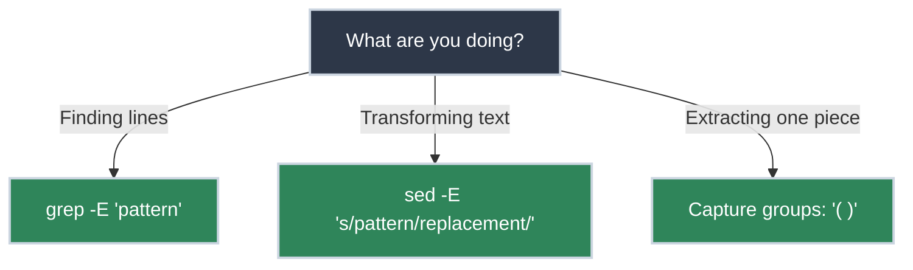

# Regular Expressions for SREs

<!-- PATHWAY_ROADMAP:START -->
<div class="pathway-pills" markdown>
:material-map-marker-path: <span class="pathway-pills__label">Part of a pathway:</span> [Debugging With Nothing But a Terminal](https://bradpenney.io/pathways/nothing-but-a-terminal){: .pathway-pill }
</div>

??? abstract ":material-map-legend: Consult the map"

    <div class="grid cards" markdown>

    -   :material-console: __Debugging With Nothing But a Terminal__ — step 5 of 20

        ---

        ← [`grep`](https://linux.bradpenney.io/essentials/grep/) · **you are here** · [Regular Expressions: The Formal Model](https://cs.bradpenney.io/efficiency/regular_expressions/) →

        [Start the pathway →](https://bradpenney.io/pathways/nothing-but-a-terminal)

    </div>
<!-- PATHWAY_ROADMAP:END -->

You're searching through 10GB of logs for an IP address. You need to find all lines that contain "ERROR" but NOT "404". You're trying to rename 500 files that follow a specific naming pattern. **This is why you need Regex.**

Regular Expressions (Regex) are a powerful language for pattern matching in text. For an SRE, Regex is the "Swiss Army Knife" of data processing. Whether you're using `grep`, `sed`, `awk`, or writing a Python script, Regex allows you to find and transform data with surgical precision.

## Quick Start: The "Survival" Syntax

If you know these characters, you can solve 80% of your log-searching problems.

| Character | Meaning | Example |
|:----------|:--------|:--------|
| `.` | Any single character | `a.c` matches `abc`, `a1c` |
| `*` | Zero or more of previous | `ab*` matches `a`, `ab`, `abbb` |
| `^` | Start of the line | `^Error` matches lines starting with "Error" |
| `$` | End of the line | `done$` matches lines ending with "done" |
| `[ ]` | Any character in brackets | `[0-9]` matches any digit |
| `` | Escape (treat next literally) | `\.` matches a literal dot |

Which tool you reach for depends on what you're actually trying to do with the match:



## Why Regex Matters for Platform Work

SREs spend much of their time searching for needles in haystacks. Logs, configurations, and API responses are all text. Regex is the filter that removes the noise.

### Common Scenarios

=== ":material-tag-outline: Finding Version Strings"

    A deploy went out with a bad release tag, and you need every line in the log that mentions a version number:
    ```bash title="Find Version Strings" linenums="1"
    grep -E "v[0-9]+\.[0-9]+\.[0-9]+" deploy.log
    ```
    Same six characters at work: `[0-9]` for the digits, `.` for the literal dots between them (escaped so it doesn't match "any character" instead).

=== ":material-swap-horizontal: Cleaning Data with sed"

    Transforming a list of `host:port` into just `host`:
    ```bash title="Extract Host" linenums="1"
    echo "prod-db:5432" | sed 's/:.*//'
    ```
    The `s/pattern/replacement/` command in `sed` is the gold standard for text transformation.

=== ":material-filter: Complex Filtering"

    Find lines that have an error code between 500 and 599:
    ```bash title="Find Server Errors" linenums="1"
    grep "HTTP/1.1 5[0-9][0-9]" access.log
    ```

## The Power of Capture Groups

Capture groups `( )` allow you to extract specific parts of a match and reuse them.

```bash title="Reformatting Dates" linenums="1"
# Change DD-MM-YYYY to YYYY-MM-DD
echo "31-12-2023" | sed -E 's/([0-9]{2})-([0-9]{2})-([0-9]{4})/\3-\2-\1/'
```


The `\1`, `\2`, and `\3` refer to the text matched inside the first, second, and third sets of parentheses.

## Practice Problems

??? question "Practice Problem 1: Anchors"

    How do you search for the word `STOP` only when it appears at the **very beginning** of a line?

    ??? tip "Answer"

        ```bash title="Match STOP at Line Start" linenums="1"
        grep "^STOP" file.txt
        ```
        The `^` anchor ensures the match only happens if "STOP" is the first thing on the line.

??? question "Practice Problem 2: Wildcards"

    What does the regex `.*` match?

    ??? tip "Answer"

        It matches **everything** (or nothing). `.` matches any character, and `*` means "zero or more of the previous." Together, they match the entire rest of a line.

## Key Takeaways

| Pattern | Match |
|:--------|:------|
| `\d` | Any digit (shorthand for `[0-9]`) |
| `\w` | Any word character (alphanumeric + underscore) |
| `+` | One or more of the previous |
| `?` | Zero or one of the previous (optional) |
| `\|` | OR (e.g., `ERROR\|CRITICAL`) |

## What's Next

The survival syntax above is enough to solve real problems today. If you're following the [Debugging With Nothing But a Terminal](https://bradpenney.io/pathways/nothing-but-a-terminal) pathway, the next step is **[Regular Expressions: The Formal Model](https://cs.bradpenney.io/efficiency/regular_expressions/)** on the Computer Science site — why a regex can take down a production system, and why some patterns are formally impossible to write.

## Further Reading

### Official Documentation
- [Regex101](https://regex101.com/) - The best interactive tool for testing and explaining your regex.
- [GNU Grep Manual](https://www.gnu.org/software/grep/manual/) - For the definitive word on how `grep` handles patterns.

### Related Tools & Alternatives
- [ripgrep (rg)](https://github.com/BurntSushi/ripgrep) - The fastest way to use regex on your filesystem.
- [Perl-Compatible Regular Expressions (PCRE)](https://www.pcre.org/) - The "advanced" flavor of regex used by many modern tools.

### Deep Dives
- [Regular Expressions: The Formal Model](https://cs.bradpenney.io/efficiency/regular_expressions/) - How regex engines actually work: backtracking, NFAs, and why ReDoS is a mathematical property, not a bug.
- [Pipes and Redirection](https://linux.bradpenney.io/essentials/pipes_and_redirection/) - Why treating everything as text you can pipe between small tools is the Unix philosophy regex lives inside of.
