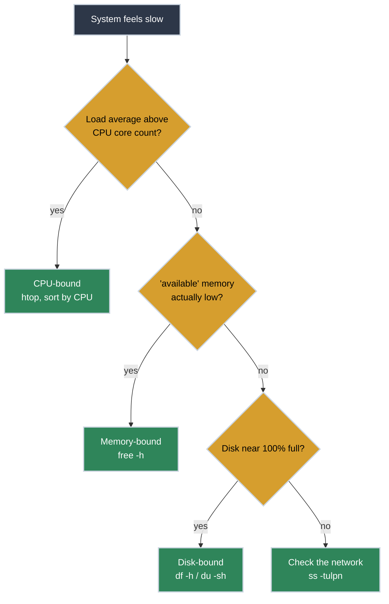

# Terminal Diagnostics: The SRE's Vital Signs

<!-- PATHWAY_ROADMAP:START -->
<div class="pathway-pills" markdown>
:material-map-marker-path: <span class="pathway-pills__label">Part of a pathway:</span> [Debugging With Nothing But a Terminal](https://bradpenney.io/pathways/nothing-but-a-terminal){: .pathway-pill }
</div>

??? abstract ":material-map-legend: Consult the map"

    <div class="grid cards" markdown>

    -   :material-console: __Debugging With Nothing But a Terminal__ — step 2 of 20

        ---

        ← [SSH Mastery](https://tools.bradpenney.io/efficiency/ssh_mastery/) · **you are here** · [Pipes and Redirection](https://linux.bradpenney.io/essentials/pipes_and_redirection/) →

        [Start the pathway →](https://bradpenney.io/pathways/nothing-but-a-terminal)

    </div>
<!-- PATHWAY_ROADMAP:END -->

The system is slow. Users are reporting timeouts. You SSH into the server and the prompt feels sluggish. **What do you look for first?**

Terminal diagnostic tools are the "stethoscopes" of the platform engineer. They allow you to observe the health of the CPU, memory, disk, and network in real-time. Mastering these tools is the difference between guessing what's wrong and knowing exactly where the bottleneck lies.

## Installation

`top`, `free`, `dmesg`, and `ss` ship with every Linux distribution — no install needed. Two tools in the checklist below don't:

=== ":material-linux: Debian/Ubuntu"

    ```bash title="Install htop and sysstat" linenums="1"
    sudo apt-get update && sudo apt-get install htop sysstat
    ```

=== ":material-linux: RHEL/CentOS/Fedora"

    ```bash title="Install htop and sysstat" linenums="1"
    sudo dnf install htop sysstat
    ```

`sysstat` is what provides `iostat`. Without it, skip straight to `ss` and `dmesg` in the checklist below.

## Quick Start: The "First 60 Seconds" Checklist

When you land on a server during an incident, run these in order. A command without a stated pass/fail signal is useless mid-incident, so here's what to actually look for at each step:

| # | Check | Command | Looks fine | Investigate further |
|:--|:------|:--------|:-----------|:---------------------|
| 1 | Load & CPU | `uptime` | Load average below your core count | Load average above your core count — CPU-bound |
| 2 | Memory | `free -h` | `available` is a healthy chunk of `total` | `available` is low **and** shrinking — actual memory pressure |
| 3 | Disk space | `df -h` | Well under 100% used | At or near 100% used — disk-bound |
| 4 | Disk I/O | `iostat -xz 1` (needs `sysstat`) | Low `%util`, low `await` | `%util` near 100% and `await` climbing — I/O-bound |
| 5 | Network | `ss -tulpn` | The ports you expect are listening | An expected port is missing, or an unexpected one is present |
| 6 | Kernel logs | `dmesg -T \| tail -n 50` | Nothing recent | OOM-killer messages, hardware errors, or repeated timeouts |

That order isn't arbitrary — each check rules out one category before you move to the next:



## Essential Diagnostic Tools

Three of the six checklist steps deserve a closer look — the ones with a real gotcha attached:

<div class="grid cards" markdown>

-   :material-speedometer: **Load Average**

    ---

    **Why it matters:** The fastest way to tell if the CPU is the bottleneck, no need to launch a full interactive session for a quick check.

    ```bash title="Check Load Average" linenums="1"
    uptime
    # 14:32:01 up 3 days, 2:15, 1 user, load average: 8.42, 6.10, 4.85
    nproc
    # 4
    ```

    

    **Key insight:** Compare that first load-average number to your core count from `nproc`. `8.42` on a 4-core box means the system is oversaturated; the same number on a 16-core box is unremarkable. `uptime` alone is enough to answer "is the CPU the bottleneck" — `htop` (or `top`) is a nice-to-have on top of that, useful when you also need to see *which* process is responsible.

-   :material-memory: **free -h**

    ---

    **Why it matters:** Shows total, used, and available memory in human-readable format.

    ```bash title="Check Memory" linenums="1"
    free -h
    #               total        used        free      buff/cache   available
    # Mem:            15Gi        3.2Gi       100Mi        12Gi          11Gi
    ```

    **Key insight:** Don't panic that "free" is only 100Mi — `available` (11Gi) is the column that matters. Linux uses unused RAM for disk caching and hands it back the instant a process needs it.

-   :material-harddisk: **df -h and du -sh**

    ---

    **Why it matters:** `df` shows partition usage; `du` finds which specific directory is eating your space.

    ```bash title="Find What's Filling the Disk" linenums="1"
    df -h /
    # Filesystem      Size  Used Avail Use% Mounted on
    # /dev/sda1        50G   48G  2.0G  97% /
    du -sh /var/log/* | sort -rh | head -5
    ```

    **Key insight:** A 100% full disk often causes silent failures in databases and logging agents — `du` sorted by size gets you to the culprit directory in one line.

</div>

## Why Diagnostics Matter for Platform Work

Diagnostics are the foundation of **Incident Response**. You cannot fix what you cannot measure. In a distributed system, being able to quickly rule out "the server is full" or "the process is OOMing" saves precious time.

### Common Scenarios

=== ":material-fire: High CPU Usage"

    Identify the process hogging the CPU:

    - Run `htop`.
    - Press `P` to sort by CPU usage.
    - If it's a Java or Python app, it might be an infinite loop or heavy GC.
    - Use `strace -p <pid>` to see what system calls the process is making in real-time.

=== ":material-lan-check: Port Conflicts"

    Why won't your new Nginx container start?

    - `ss -tulpn | grep :80`
    - This shows you exactly which process ID (PID) is already listening on port 80.
    - `ss` is the modern replacement for the older `netstat`.

=== ":material-file-alert: Ghost Files"

    `df` says the disk is full, but `du` can't find the files?

    - A process might be holding a deleted file open.
    - Use `lsof +L1` to find deleted files that are still consuming space because a process hasn't closed them.

Most of the commands above have a faster or friendlier modern replacement worth knowing:

## Key Diagnostic Commands

| Command | Purpose | Modern Alternative |
|:--------|:--------|:-------------------|
| `uptime` | One-line load average check | — |
| `top` | Interactive, live process monitor | `htop`, `btop` |
| `netstat`| Network connections | `ss` |
| `ifconfig`| Interface config | `ip addr` |
| `find` | Finding files | `fd` |
| `du` | Disk usage per dir | `dust` |
| `tail -f`| Follow logs | `multitail` |

## Practice Problems

??? question "Practice Problem 1: Identifying Memory Pressure"

    You run `free -h` and see that `free` is 100MB, but `available` is 4GB. Should you be worried about an Out-of-Memory (OOM) event?

    ??? tip "Answer"

        **No.** Linux is designed to use almost all available RAM for disk caching to improve performance. The `available` column is the one that matters — it tells you how much memory can be reclaimed for new processes without causing the system to swap.

??? question "Practice Problem 2: Finding a Process"

    You need to find the PID of a running process named `sidekiq` so you can kill it. What's the fastest command?

    ??? tip "Answer"

        ```bash title="Find a Process by Name" linenums="1"
        pgrep -af sidekiq
        ```
        `pgrep` finds the PID, and `-af` shows the full command line so you can be sure you're targeting the right instance.

## What's Next

If you're following the [Debugging With Nothing But a Terminal](https://bradpenney.io/pathways/nothing-but-a-terminal) pathway, the next step is **[Pipes and Redirection](https://linux.bradpenney.io/essentials/pipes_and_redirection/)** on the Linux site — chaining these same commands together instead of running them one at a time. From there, [grep](https://linux.bradpenney.io/essentials/grep/) is the next stop once you've ruled out "the box itself is fine" and need to know what the logs actually say.

## Further Reading

### Official Documentation
- [The Brendan Gregg Blog](https://www.brendangregg.com/linuxperf.html) - The gold standard for Linux performance analysis.
- `man proc` - Understand the `/proc` filesystem where all this data comes from.

### Related Tools & Alternatives
- [btop](https://github.com/aristocratos/btop) - A high-performance, beautiful system monitor.
- [Glances](https://nicolargo.github.io/glances/) - An all-in-one cross-platform monitoring tool.

### Deep Dives
- [How the OS Scheduler Actually Decides](https://cs.bradpenney.io/efficiency/systems/os_scheduler/) - How the OS decides which process gets CPU time, the mechanism behind the load average this article tells you to check first.
