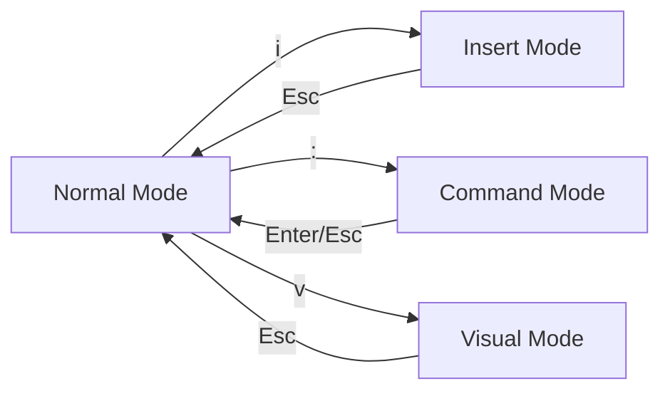

# Vim Survival Mode

You're SSH'd into a production server. You need to fix a critical config error. You type `vi config.yaml` and suddenly you're in a world where the arrow keys don't work quite right, and you can't even figure out how to type. **Don't panic.**

Vim is a ubiquitous text editor available on almost every Unix-like system. While it has a legendary learning curve, SREs only need a handful of commands to be dangerous. This is "Survival Mode"—the bare essentials to get in, fix the problem, and get out.

## The Most Important Rule: Modal Editing

Vim is not like Notepad or VS Code. It is **modal**. It has different "modes" for different tasks.

1.  **Normal Mode**: For moving around and deleting text. **This is the default.**
2.  **Insert Mode**: For actually typing text.
3.  **Command Mode**: For saving, quitting, and other editor-wide actions.

## Quick Start: Get Productive in 5 Minutes

If you remember nothing else, remember these four steps:

1.  **Get in**: `vi <filename>`
2.  **Type stuff**: Press `i` (to enter Insert Mode), then type your changes.
3.  **Stop typing**: Press `Esc` (to return to Normal Mode).
4.  **Get out**: Type `:wq` and press `Enter` to save and quit. (Or `:q!` to quit without saving).

## Essential Motions

In Normal Mode, your keyboard becomes a navigation tool.

-   :material-cursor-move: **Basic Navigation**

    ---

    **Why it matters:** You can move faster than using arrow keys (which might not even work in some terminal configurations).

    - `h` (left), `j` (down), `k` (up), `l` (right)
    - `w`: Move forward one word
    - `b`: Move back one word

-   :material-format-vertical-align-top: **Jumping Around**

    ---

    **Why it matters:** Useful for large config files or long logs.

    - `gg`: Go to the top of the file
    - `G`: Go to the bottom of the file
    - `0`: Go to start of line
    - `$`: Go to end of line

-   :material-eraser: **Quick Edits**

    ---

    **Why it matters:** Fixing mistakes without entering Insert Mode.

    - `x`: Delete a single character
    - `dd`: Delete the entire line
    - `u`: Undo the last change

## Why Vim Matters for Platform Work

As an SRE, you often work on "headless" systems (no GUI) or remote servers via SSH. Vim is the one tool you can guarantee will be there. Mastering survival mode means you're never "stuck" in a terminal environment.

### Common Scenarios

=== ":material-alert: Hotfix in Production"

    1. `vi /etc/nginx/nginx.conf`
    2. `/server_name` (Search for the config line)
    3. `i` (Enter insert mode)
    4. Fix the typo
    5. `Esc`
    6. `:wq` (Save and quit)

=== ":material-text-search: Searching Logs"

    When viewing a large file in Vim:
    - `/pattern`: Search forward for "pattern"
    - `?pattern`: Search backward
    - `n`: Go to the next match
    - `N`: Go to the previous match

=== ":material-content-copy: Copy/Paste (Vim Style)"

    - `yy`: "Yank" (copy) a line
    - `p`: "Put" (paste) after the cursor
    - `P`: "Put" (paste) before the cursor

## Practice Problems

??? question "Practice Problem 1: Getting Unstuck"

    You've typed a bunch of random keys and now Vim is beeping at you and showing weird symbols. How do you get back to a clean state where you can quit?

    ??? tip "Answer"

        Press `Esc` multiple times. This ensures you are in **Normal Mode**. From there, you can type `:q!` to quit without saving any of the accidental changes you might have made.

??? question "Practice Problem 2: Deleting Text"

    You need to remove 5 lines of a config file. What's the fastest way to do it in Normal Mode?

    ??? tip "Answer"

        Type `5dd`. In Vim, many commands can be preceded by a number to repeat the action that many times. `dd` deletes a line, so `5dd` deletes five.

## Key Takeaways

| Key | Action |
|:----|:-------|
| `i` | Enter **Insert Mode** |
| `Esc` | Return to **Normal Mode** |
| `:w` | Write (Save) the file |
| `:q` | Quit |
| `:wq` | Save and Quit |
| `:q!` | Quit without saving |
| `/text` | Search for "text" |

## Further Reading

### Official Documentation
- `vimtutor` - Run this command in your terminal for an interactive 15-minute tutorial.
- [Vim Help](https://vimhelp.org/) - Online version of Vim's internal documentation.

### Related Tools & Alternatives
- [NeoVim](https://neovim.io/) - A modern fork of Vim with better defaults and extensibility.
- [Nano](https://www.nano-editor.org/) - A simpler, non-modal terminal editor (but not always installed).

### Deep Dives
- [Vim Adventures](https://vim-adventures.com/) - A game that teaches Vim motions.
- [Modal Editing Philosophy](https://cs.bradpenney.io/building_blocks/computational_thinking/) - Why separating navigation from editing is a powerful abstraction.
