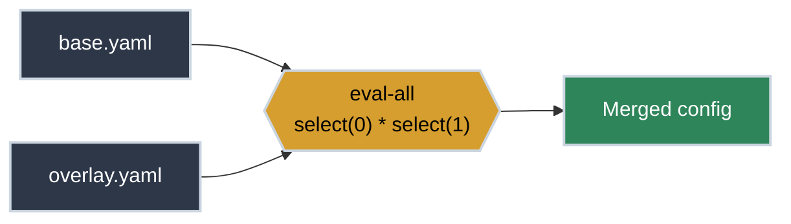

# YQ: Wrangling YAML Configs

<!-- PATHWAY_ROADMAP:START -->
<div class="pathway-pills" markdown>
:material-map-marker-path: <span class="pathway-pills__label">Part of a pathway:</span> [Debugging With Nothing But a Terminal](https://bradpenney.io/pathways/nothing-but-a-terminal){: .pathway-pill }
</div>

??? abstract ":material-map-legend: Consult the map"

    <div class="grid cards" markdown>

    -   :material-console: __Debugging With Nothing But a Terminal__ — step 11 of 20

        ---

        ← [Working with YAML](https://python.bradpenney.io/essentials/yaml/) · **you are here** · [Vim Survival Mode](https://tools.bradpenney.io/essentials/vim_survival_mode/) →

        [Start the pathway →](https://bradpenney.io/pathways/nothing-but-a-terminal)

    </div>
<!-- PATHWAY_ROADMAP:END -->

Kubernetes manifests, Ansible playbooks, GitHub Actions, Docker Compose — in modern platform engineering, **YAML is everywhere.** But YAML's indentation-sensitive nature makes it notoriously difficult to edit with standard text tools like `sed` or `awk`.

`yq` is a portable command-line YAML processor. It's essentially `jq` for YAML, allowing you to slice, dice, and transform configuration files with precision and safety.

## Installation

=== ":material-linux: Linux"

    ```bash title="Install yq on Linux" linenums="1"
    # Debian/Ubuntu (snap)
    sudo snap install yq

    # Or download the binary directly
    sudo wget https://github.com/mikefarah/yq/releases/latest/download/yq_linux_amd64 -O /usr/bin/yq
    sudo chmod +x /usr/bin/yq
    ```

=== ":material-apple: macOS"

    ```bash title="Install yq on macOS" linenums="1"
    brew install yq
    ```

=== ":material-microsoft-windows: Windows"

    ```bash title="Install yq on Windows" linenums="1"
    choco install yq
    # or
    scoop install yq
    ```

Verify installation and confirm you have the [mikefarah/yq](https://github.com/mikefarah/yq) implementation (there are several unrelated tools sharing the name):

```bash title="Check yq Version" linenums="1"
yq --version
# Output: yq (https://github.com/mikefarah/yq/) version v4.x.x
```

## Quick Start: Get Productive in 5 Minutes

`yq` syntax is intentionally similar to `jq`. If you know one, you're halfway to knowing the other.

```bash title="Common YQ Operations" linenums="1"
# Read a specific value from a K8s manifest
yq '.metadata.name' pod.yaml

# Update a value in-place
yq -i '.spec.replicas = 3' deployment.yaml

# Convert YAML to JSON (perfect for piping to jq)
yq -o=json '.' config.yaml

# Merge two YAML files
yq eval-all 'select(fileIndex == 0) * select(fileIndex == 1)' base.yaml overlay.yaml
```


That last one is the pattern worth internalizing — a base config and an environment-specific overlay merge into one result, the same shape whether you're reconciling two files by hand or reading how a templating tool does it for you:



## Why YQ Matters for Platform Work

YAML is the backbone of Infrastructure as Code (IaC). One wrong indentation can break a production deployment. `yq` removes this friction by treating YAML as a structured data format rather than a text file.

### Common Scenarios

=== ":material-kubernetes: K8s Manifest Auditing"

    Find all containers in a Deployment that don't have resource limits defined:

    ```bash title="Audit Resource Limits" linenums="1"
    yq '.spec.template.spec.containers[] | select(has("resources") | not) | .name' deployment.yaml
    ```

=== ":material-github: CI/CD Pipeline Updates"

    Update the image tag across multiple GitHub Action workflow files:

    ```bash title="Update Image Tag" linenums="1"
    yq -i '.jobs.build.steps[] | select(.uses == "docker/build-push-action*") | .with.tags = "v2.1.0"' .github/workflows/*.yml
    ```

=== ":material-sync: Config Transformation"

    Extract values from a legacy config and format them for a new system:

    ```bash title="Extract and Format" linenums="1"
    yq '.database | {host: .addr, port: .port}' old-config.yaml
    ```

## Core Functionality

Three behaviors cover most of what you'll reach for day to day:

<div class="grid cards" markdown>

-   :material-pencil: **In-place Editing (`-i`)**

    ---

    **Why it matters:** Allows you to modify files directly without temporary files or redirects.

    ``` bash title="Update Config" linenums="1"
    yq -i '.debug = true' config.yaml
    ```

    **Key insight:** Always verify your filter *without* `-i` first — and treat the edit as step one, not step three. Edit the git-tracked manifest, commit, and let your pipeline or reconciler apply it. Piping straight into `kubectl apply` against a running cluster skips the review and audit trail Git exists to give you.

-   :material-file-tree: **Multi-document Handling**

    ---

    **Why it matters:** Kubernetes files often contain multiple documents separated by `---`.

    ``` bash title="Read All Documents" linenums="1"
    yq '.. | select(has("kind")) | .kind' multi.yaml
    ```

    **Key insight:** `yq` handles the stream of documents automatically.

-   :material-swap-horizontal: **Format Conversion (`-o`)**

    ---

    **Why it matters:** Sometimes you need JSON for a tool that doesn't speak YAML.

    ``` bash title="YAML to JSON" linenums="1"
    yq -o=json '.' service.yaml
    ```

    **Key insight:** Useful for interoperability between different CLI tools.

</div>

## Common Pitfalls

<div class="grid cards" markdown>

-   :material-alert-circle: **Two Different Tools Share This Name**

    ---

    `mikefarah/yq` (what this article covers) and `kislyuk/yq` (a Python wrapper that converts YAML to JSON and pipes it through the real `jq`) use different filter syntax entirely. A filter that works in one throws a cryptic error in the other — check which one you actually have.

    ```bash title="Confirm Which yq You Have" linenums="1"
    yq --version
    # yq (https://github.com/mikefarah/yq/) version v4.x.x   ✅ this article
    # yq 3.x.x                                                ❌ kislyuk/yq — different syntax
    ```

-   :material-alert-circle: **Forgetting `-i` Means Nothing Is Saved**

    ---

    Without `-i`, `yq` prints the modified document to your terminal and leaves the file on disk untouched — easy to mistake for "the edit didn't work."

    ```bash title="Wrong - Prints to Screen, File Unchanged" linenums="1"
    yq '.spec.replicas = 3' deployment.yaml   # ❌ stdout only, file untouched
    ```

    ```bash title="Correct - Writes Back to the File" linenums="1"
    yq -i '.spec.replicas = 3' deployment.yaml   # ✅ saved in place
    ```

-   :material-alert-circle: **Same Shell-Quoting Trap as `jq`**

    ---

    `yq` filters starting with `.` and containing `[]` are just as vulnerable to shell glob expansion as [`jq`'s are](jq_parsing_json.md#common-pitfalls). Always quote:

    ```bash title="Always Quote the Filter" linenums="1"
    yq '.spec.template.spec.containers[]' deployment.yaml   # ✅ quoted
    ```

</div>

## Practice Problems

??? question "Practice Problem 1: Navigating Lists"

    In a YAML file like `{"items": [{"name": "a", "val": 1}, {"name": "b", "val": 2}]}`, how do you get the value (`val`) for the item named "b"?

    ??? tip "Answer"

        ```bash title="Select a Field from a Matching List Item" linenums="1"
        yq '.items[] | select(.name == "b") | .val' file.yaml
        ```
        This iterates through the list, filters for the specific name, and then selects the desired field.

??? question "Practice Problem 2: Adding a Field"

    How would you add a `labels` object with `app: my-app` to the `metadata` of a YAML file?

    ??? tip "Answer"

        ```bash title="Add a Nested Field, Creating Parents as Needed" linenums="1"
        yq '.metadata.labels.app = "my-app"' file.yaml
        ```
        `yq` will automatically create the parent objects (`labels`) if they don't exist.

## Key Takeaways

| Feature | command/Filter |
|:--------|:---------------|
| **Read** | `yq '.path.to.key' file.yaml` |
| **Write** | `yq -i '.key = "value"' file.yaml` |
| **Filter** | `select(.key == "match")` |
| **Convert** | `-o=json` (to JSON), `-o=xml` (to XML) |
| **Delete** | `del(.key.to.remove)` |

## What's Next

If you're following the [Debugging With Nothing But a Terminal](https://bradpenney.io/pathways/nothing-but-a-terminal) pathway, the next step is **[Vim Survival Mode](vim_survival_mode.md)** — `vi`/`vim` is still what you'll find on almost every server when there's no time to install anything else, and it covers the four commands that get you in, fixed, and out.

## Further Reading

### Official Documentation
- [YQ Documentation](https://mikefarah.gitbook.io/yq/) - Comprehensive guide for the most popular `yq` implementation (mikefarah).
- [YQ GitHub Repository](https://github.com/mikefarah/yq) - Source code and community discussions.

### Related Tools & Alternatives
- [jq](https://stedolan.github.io/jq/) - The JSON processor that inspired `yq`.
- [yamllint](https://yamllint.readthedocs.io/) - For validating YAML syntax and style.

### Deep Dives
- [YAML Specification](https://yaml.org/spec/1.2.2/) - For when you really need to understand why your indentation is broken.
- [How Parsers Work](https://cs.bradpenney.io/efficiency/how_parsers_work/) - The lexing-then-parsing pipeline underneath every `yq` call.
