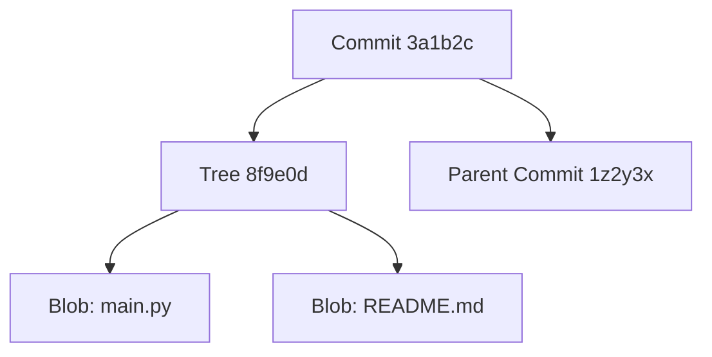

# Git Internals: Blobs, Trees, and Commits

Most developers use Git every day, but few understand how it works under the hood. We think of Git as storing "changes" (diffs), but that is a lie.

Git is actually a **Content-Addressable Filesystem**. It is a key-value database where the "Key" is the SHA-1 hash of the data, and the "Value" is the data itself.

## The Three Objects

Git is built on three fundamental objects:

### 1. The Blob (Binary Large Object)
A Blob stores the **content** of a file. It does not store the filename, the timestamp, or who wrote it. It is just the raw data.

If you have two files (`a.txt` and `b.txt`) that both contain the text "Hello World", Git only stores **one** Blob. This is deduplication at the content level.

### 2. The Tree
A Tree stores the **directory structure**. It maps filenames to Blobs (or other Trees).

A Tree looks like this:
```text
100644 blob a906cb2...   README.md
100644 blob 2e56a7f...   main.py
040000 tree 92b8d23...   src/
```

### 3. The Commit
A Commit is a wrapper around a Tree. It adds the "human" context:
-   **Author:** Who made it?
-   **Date:** When?
-   **Message:** Why?
-   **Parent:** What came before this?

## The DAG (Directed Acyclic Graph)

Because every commit points to its parent, a history of commits forms a chain. Because branches can split and merge, this chain forms a **Graph**.

-   **Directed:** Time flows forward (Child -> Parent).
-   **Acyclic:** You can't loop back in time.

## Visualizing the Structure



## Practice Problems

??? question "Practice Problem 1: Deduplication"

    You create a file `test.txt` with the content "Hello". You commit it.
    You create a new file `copy.txt` with the content "Hello". You commit it.
    
    How many **Blob** objects does Git store in the `.git` folder?

    ??? tip "Solution"
        **One.**
        
        Since both files have the exact same content ("Hello"), they hash to the same SHA-1 value. Git stores that blob once. The two different filenames are stored in the **Tree** object, pointing to the same Blob hash.

??? question "Practice Problem 2: The Hash"

    Why does changing a single character in a file change the Commit ID?

    ??? tip "Solution"
        1. Changing content changes the **Blob Hash**.
        2. Changing the Blob Hash changes the **Tree Hash** (because the Tree lists the Blob's hash).
        3. Changing the Tree Hash changes the **Commit Hash** (because the Commit points to the Tree).
        
        This "Avalanche Effect" ensures cryptographic integrity. You cannot alter history without changing every ID that comes after it.

## Key Takeaways

| Object | Stores |
| :--- | :--- |
| **Blob** | File Content. |
| **Tree** | Filenames and Directory Structure. |
| **Commit** | History and Metadata. |

---

Understanding that Git is just a graph of hashed objects demystifies complex operations. A "Branch" is just a sticky note pointing to a specific commit. A "Merge" is just creating a new commit with two parents. It's all just pointers.
