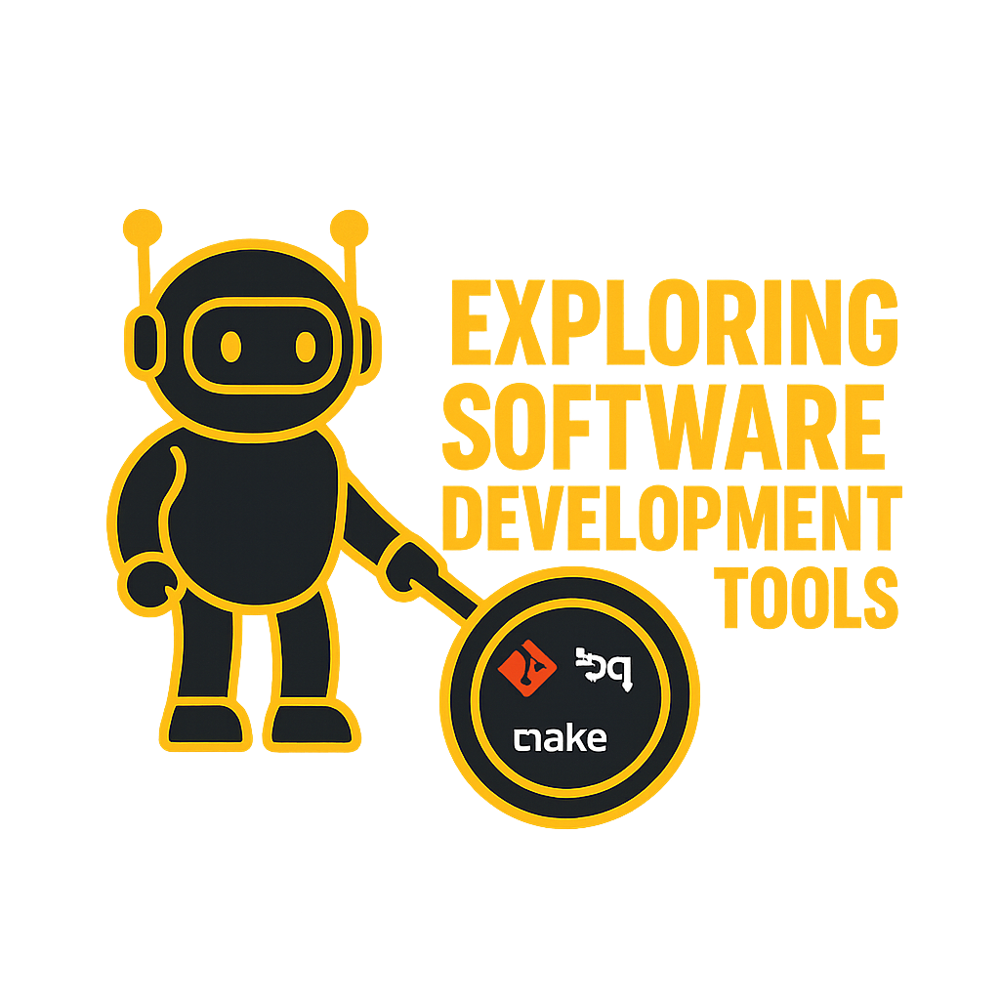

# Exploring Software Development Tools

**Remove tool friction. Work faster. Keep platforms running.**

Welcome to a practical guide for SREs and Platform Engineers who need to master the tools that make infrastructure work scale.

## The Problem

It's 2am. The API is down. You SSH into the server, and suddenly you're fighting your tools instead of fixing the problem. You're parsing JSON by squinting at your terminal. Your SSH connection drops and you lose your work. You're typing the same 15 commands for the hundredth time this week.

**This is tool friction. This site exists to remove it.**

## The Solution

While [exploring_linux](https://linux.bradpenney.io), [exploring_python](https://python.bradpenney.io), and [exploring_kubernetes](https://k8s.bradpenney.io) teach *what* to do, this site teaches *how* to do it efficiently. Master these tools and you'll:

- Save 10+ hours per week on repetitive tasks
- Debug incidents faster with proper tooling
- Stop losing work to dropped SSH connections
- Parse JSON/YAML without squinting
- Edit configs on remote servers without pain

## How It's Organized

Content is structured by **urgency and job context**:

-   :material-package-variant: **📦 Essentials**

    ---

    **Core tools you need today.** Can't do the job without these. Each tool has a series of articles.

    **Git Series:**

    - **[Git Basics](./essentials/git/git_basics.md)** - Your first repository, three states, local version control
    - **[Git Collaboration](./essentials/git/git_collaboration.md)** - Remote repos, GitHub/GitLab, teamwork
    - Git Safety (coming soon) - .gitignore, secrets, undo commands
    - Git Configuration (coming soon) - Aliases, editor setup, advanced config

    **JQ Series:** (coming soon)

    **YQ Series:** (coming soon)

    **Vim Series:** (coming soon)
    - YQ - Wrangle YAML configs for K8s/Ansible (coming soon)
    - Vim Survival Mode - Edit on servers (coming soon)

-   :material-lightning-bolt: **⚡ Efficiency**

    ---

    **Make your day 10x easier.** Tools that transform how you work.

    - Terminal Multiplexing (`tmux`) - Persistent SSH sessions
    - VS Code Remote - Edit on servers comfortably
    - Shell Productivity (`fzf`, aliases) - Save hours typing
    - Git Workflows - Branches and conflict resolution

-   :material-target: **🎯 Mastery**

    ---

    **Optional power tools.** For when you need maximum efficiency.

    - NeoVim Full Setup - Terminal IDE for remote work
    - Advanced Shell - Custom functions, automation
    - Automation Patterns - Makefiles, pre-commit hooks
    - GitHub Actions - Infrastructure CI/CD

## Who This Is For

You're an **SRE or Platform Engineer** who:

- Responds to incidents (on-call rotations, debugging under pressure)
- Manages infrastructure as code (Terraform, Ansible, K8s manifests)
- Works primarily in terminal environments (SSH, remote servers)
- Needs to parse JSON/YAML constantly (APIs, kubectl output, logs)
- Wants to automate repetitive tasks

You may or may not have a traditional developer background. **This site meets you where you are.**

## Integration with Other Sites

This site is part of the [BradPenney.io](https://bradpenney.io) learning ecosystem:

- **[linux.bradpenney.io](https://linux.bradpenney.io)** - Linux commands and system administration
- **[k8s.bradpenney.io](https://k8s.bradpenney.io)** - Kubernetes for platform engineers
- **[python.bradpenney.io](https://python.bradpenney.io)** - Python automation and scripting
- **[cs.bradpenney.io](https://cs.bradpenney.io)** - Computer science fundamentals

**How they connect:**

- Linux site + Tools site = Terminal mastery
- Python site + Tools site = Automation capability
- Kubernetes site + Tools site = Platform debugging skills

---

**Ready to remove tool friction?** Start with [Git Basics](./essentials/git/git_basics.md) - the first article in the Git Essentials series - to professionalize your scripts and infrastructure code.
