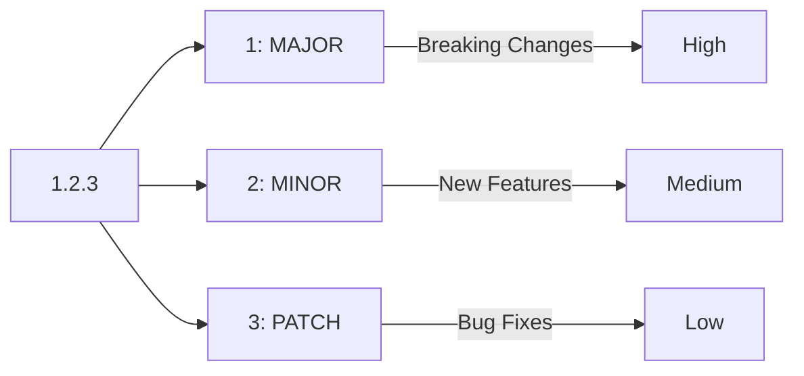

# Semantic Versioning for Internal Tools

You've updated a common script used by your team, and now half of your CI pipelines are failing. You thought the change was "small," but it broke a downstream dependency you didn't know existed. **This is why we use Semantic Versioning (SemVer).**

Semantic Versioning (SemVer) is a simple set of rules and requirements that dictate how version numbers are assigned and incremented. For SREs building internal tools, modules, and APIs, SemVer provides a contract that tells your users (and your automation) what to expect when you release an update.

## The SemVer Structure

A version number follows the format `MAJOR.MINOR.PATCH`.

1.  **MAJOR**: Incremented when you make **incompatible API changes**.
2.  **MINOR**: Incremented when you **add functionality** in a backwards compatible manner.
3.  **PATCH**: Incremented when you make **backwards compatible bug fixes**.

## Quick Start: When to Increment

| Change Type | Version Increment | Example |
|:------------|:------------------|:--------|
| **Bug Fix** | `PATCH` (1.0.0 → 1.0.1) | Fixed a typo in a help message. |
| **New Feature** | `MINOR` (1.0.1 → 1.1.0) | Added a new flag to your CLI tool. |
| **Breaking Change** | `MAJOR` (1.1.0 → 2.0.0) | Renamed a required flag or changed output format. |

## Why SemVer Matters for Platform Work

In Platform Engineering, your "users" are often other automated systems. If your `terraform-module-vpc` v1.0.0 is used by 50 projects, a breaking change without a MAJOR version bump will cause 50 broken pipelines.

### Common Scenarios

=== ":material-terraform: Terraform Modules"

    Always use SemVer for your internal Terraform modules.
    - `v1.x.x`: Users can safely update.
    - `v2.x.x`: Users must manually check for breaking changes (like a removed variable).
    - In your code: `version = "~> 1.0"` allows PATCH/MINOR updates but stops at 2.0.

=== ":material-docker: Docker Image Tagging"

    Stop using `:latest`. It's non-deterministic and dangerous.
    - Tag images with their full SemVer: `my-service:1.2.3`.
    - Provide "moving" tags for convenience: `my-service:1` (points to latest 1.x.x) and `my-service:1.2` (points to latest 1.2.x).

=== ":material-github: Automated Releases"

    Use tools like `semantic-release` or `conventional-commits` to automate your versioning.
    - If your commit message starts with `feat:`, the tool bumps the MINOR version.
    - If it starts with `fix:`, it bumps the PATCH version.
    - If the body contains `BREAKING CHANGE:`, it bumps the MAJOR version.

## Core Versioning Patterns

-   :material-numeric-0-box: **The 0.y.z Phase**

    ---

    **Why it matters:** Initial development. Anything can change at any time. Do not rely on 0.x versions for production-critical systems.

-   :material-history: **Backwards Compatibility**

    ---

    **Why it matters:** If you can add a feature without breaking existing users, always prefer a MINOR bump. It builds trust with your team.

-   :material-alphabetical: **Pre-releases**

    ---

    **Why it matters:** Use suffixes like `-alpha`, `-beta`, or `-rc` (Release Candidate) for testing new infrastructure changes before they go live.

## Practice Problems

??? question "Practice Problem 1: Increment Decision"

    You are updating a shared Python library used for incident response. You added a new function to calculate uptime, but didn't change any existing functions. What is the correct SemVer increment?

    ??? tip "Answer"

        This is a **MINOR** increment (e.g., 1.2.3 → 1.3.0). You added functionality in a backwards-compatible way.

??? question "Practice Problem 2: Breaking Changes"

    You are refactoring a shell script. You realized that a flag named `--verbose` was spelled incorrectly as `--verbos`. You fixed the spelling. Is this a PATCH or a MAJOR change?

    ??? tip "Answer"

        Technically, this is a **MAJOR** change. Any existing automation that relies on the `--verbos` flag will now break. In the world of SemVer, "correcting" an API is still a breaking change if it breaks existing users.

## Key Takeaways

| Rule | Meaning |
|:-----|:--------|
| **Major** | Incompatible changes; user must take action. |
| **Minor** | New features; backwards compatible. |
| **Patch** | Fixes; backwards compatible. |
| **No `:latest`** | Be explicit with your versions in production. |
| **Contract** | A version number is a promise to your users. |

## Further Reading

### Official Documentation
- [SemVer.org](https://semver.org/) - The full Semantic Versioning specification.
- [Conventional Commits](https://www.conventionalcommits.org/) - A specification for adding human and machine readable meaning to commit messages.

### Related Tools & Alternatives
- [Release-it](https://github.com/release-it/release-it) - Interactive tool to automate SemVer releases.
- [Standard Version](https://github.com/conventional-changelog/standard-version) - Automate versioning and CHANGELOG generation.

### Deep Dives
- [Dependency Management](https://cs.bradpenney.io/building_blocks/computational_thinking/) - How SemVer helps solve the "dependency hell" problem.
- [API Design](https://cs.bradpenney.io/building_blocks/how_parsers_work/) - Principles of building stable, versionable interfaces.
