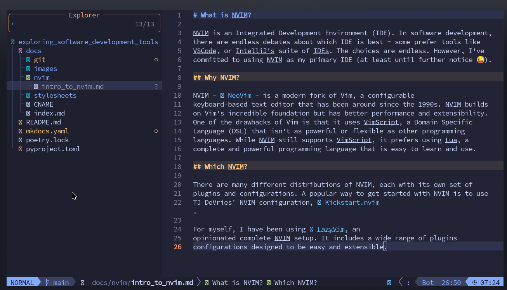

# What is NeoVim?

Every developer reaches a point where their text editor becomes a bottleneck. Mouse movements to select text, reaching for arrow keys to navigate, context switching between terminal and editor—these micro-inefficiencies compound over thousands of daily edits. What if your editor could keep pace with the speed of thought, where navigation and editing commands flow directly from your fingers without conscious translation?

[NeoVim](https://neovim.io/) (often abbreviated as Neovim or NVIM) is a modern, extensible text editor and development environment that prioritizes keyboard-driven workflows through modal editing. It's a refactored continuation of Vim, one of the most influential text editors in computing history, with better performance, a more maintainable codebase, and first-class support for modern development tools.

## Modal Editing: The Core Concept

The defining characteristic of NeoVim is **modal editing**—the editor operates in different modes, and the same keystrokes perform different actions depending on which mode you're in.

**The Four Primary Modes**

| Mode | Purpose | How to Enter | Example Key Behavior |
|:-----|:--------|:-------------|:---------------------|
| **Normal** | Navigate and manipulate text | `Esc` from any mode | `dd` deletes a line, `w` moves forward one word |
| **Insert** | Type text normally | `i` from Normal mode | `d` types the letter "d" |
| **Visual** | Select text | `v` from Normal mode | `d` deletes selected text |
| **Command** | Execute editor commands | `:` from Normal mode | `:w` saves file, `:q` quits |

This modal design gives every key a second (or third) layer of functionality. In Normal mode, `d` is a deletion operator. In Insert mode, `d` types the letter "d". This duality means you never need to reach for modifier keys (Ctrl, Alt) or the mouse for common editing operations.

**Why This Matters**

Modal editing feels unnatural at first—most editors use a single mode where letters always insert text. But the payoff is profound: your keyboard becomes a language for manipulating text. `ciw` means "change inner word." `d$` means "delete to end of line." `>ap` means "indent around paragraph." These compose like grammar, and once you internalize the patterns, editing happens at the speed of thought—a practical application of [computational thinking](https://cs.bradpenney.io/building_blocks/computational_thinking/) where you decompose complex editing tasks into composable primitives.

## NeoVim vs. Vim: What Changed?

NeoVim is a fork of Vim, started in 2014 by Thiago de Arruda Padilha to address long-standing architectural issues. Both editors share the same core modal editing model, but NeoVim introduces key improvements:

**Better Architecture**

- **Asynchronous everything**: Plugins can run without freezing the editor
- **Built-in terminal emulator**: Run shells and REPLs inside NeoVim
- **Extensibility via Lua**: Lua is a full-featured programming language, unlike Vim's VimScript

**Lua Configuration and Plugins**

Vim uses VimScript, a domain-specific language (DSL) created for editor customization. VimScript is powerful but quirky and slow. NeoVim still supports VimScript for backward compatibility but prefers Lua—a clean, fast, widely-used scripting language.

```lua title="NeoVim Configuration Example" linenums="1"
-- Set line numbers
vim.opt.number = true          -- (1)!
vim.opt.relativenumber = true  -- (2)!

-- Set tab behavior
vim.opt.tabstop = 4
vim.opt.shiftwidth = 4
vim.opt.expandtab = true       -- (3)!

-- Key mapping: jk to exit Insert mode
vim.keymap.set('i', 'jk', '<Esc>', { noremap = true })  -- (4)!
```

1. Show line numbers on the left
2. Show relative line numbers for easy motion commands like `10j`
3. Convert tabs to spaces
4. Pressing `j` then `k` quickly in Insert mode returns to Normal mode

**Modern Tooling Integration**

NeoVim has first-class support for:

- **LSP (Language Server Protocol)**: Built-in client for autocomplete, go-to-definition, refactoring
- **Tree-sitter**: Fast, accurate syntax highlighting and code understanding using [parsing techniques](https://cs.bradpenney.io/building_blocks/how_parsers_work/) and [finite state machines](https://cs.bradpenney.io/building_blocks/finite_state_machines/)
- **DAP (Debug Adapter Protocol)**: Native debugging support
- **Remote plugins**: Plugins can be written in any language

## NeoVim Distributions

Setting up NeoVim from scratch involves choosing and configuring dozens of plugins. Distributions provide pre-configured setups optimized for specific workflows.

**Popular Distributions**

=== ":material-rocket-launch: LazyVim"

    [LazyVim](https://www.lazyvim.org/) is an opinionated, batteries-included NeoVim distribution.

    **Philosophy**: Sensible defaults with easy customization. Pre-configured for web development, Rust, Go, Python, and more.

    **Key Features**:
    - Pre-configured LSP for 30+ languages
    - Integrated terminal, file explorer, fuzzy finder
    - Git integration with signs and blame
    - Extensible via Lua modules

    **Best for**: Developers who want a full IDE experience immediately

=== ":material-timer-outline: Kickstart.nvim"

    [Kickstart.nvim](https://github.com/nvim-lua/kickstart.nvim) is a minimal starter configuration by TJ DeVries (NeoVim core maintainer).

    **Philosophy**: Small, understandable foundation you build upon.

    **Key Features**:
    - Single-file configuration (~500 lines)
    - LSP, Tree-sitter, and Telescope pre-configured
    - Heavily commented to teach NeoVim concepts

    **Best for**: Developers who want to understand every line of their config

=== ":material-code-braces: AstroNvim"

    [AstroNvim](https://astronvim.com/) is a feature-rich, customizable distribution.

    **Philosophy**: All the bells and whistles, organized modularly.

    **Key Features**:
    - Beautiful UI with custom statusline and bufferline
    - Advanced LSP configuration
    - Project-specific configurations

    **Best for**: Developers who want maximum functionality out of the box

Here's a screenshot of this file being created in LazyVim:



## Why NeoVim Matters

**Efficiency Through Composability**

NeoVim's command language composes like natural language. Want to delete from the cursor to the end of the line? `d$`. Change text inside parentheses? `ci(`. Delete three words? `d3w`. These patterns extend infinitely—once you learn the grammar, you can express any editing operation without reaching for the mouse or thinking about the mechanics.

**Keyboard-Centric Workflow**

Moving your hands from home row slows you down. NeoVim keeps your fingers on the keyboard: navigate with `hjkl`, jump to characters with `f` and `t`, manipulate text with operators and motions. The result is faster editing and less hand strain.

**Fully Customizable Environment**

NeoVim isn't opinionated about your workflow—it's a toolkit. Want a minimal setup? Configure 50 lines of Lua. Want an IDE with autocomplete, debugging, Git integration, and terminal? Add plugins. Your editor grows with your needs.

**Universal Availability**

Vim/NeoVim runs on Linux, macOS, Windows, BSD, and many other platforms. Even on servers over SSH with no GUI, you have a full-featured editor. Learn NeoVim once, use it everywhere.

**Active Ecosystem**

NeoVim's plugin ecosystem is thriving. LSP support means every language with a language server gets autocomplete and refactoring. Tree-sitter brings context-aware syntax highlighting. Lua configuration means plugins are fast and maintainable.

???+ warning "Learning Curve"

    NeoVim has a steep initial learning curve. Modal editing requires rewiring muscle memory. The first week feels frustratingly slow. But the investment pays dividends: after a month, you'll edit faster than you ever did with a mouse-driven editor. After a year, you'll wonder how you ever worked any other way.

    **Tips for Getting Started**:

    - Run `vimtutor` (included with Vim/NeoVim) for an interactive 30-minute tutorial
    - Force yourself to stay in NeoVim for at least two weeks
    - Learn incrementally—master Normal mode navigation before diving into plugins
    - Use a distribution like LazyVim or Kickstart to avoid configuration overwhelm

## Essential NeoVim Concepts

### Motions and Operators

NeoVim's editing language consists of **operators** (actions) and **motions** (targets).

**Common Operators**:
- `d` - delete
- `c` - change (delete and enter Insert mode)
- `y` - yank (copy)
- `>` - indent
- `<` - unindent

**Common Motions**:
- `w` - to start of next word
- `b` - back to start of word
- `e` - to end of word
- `$` - to end of line
- `gg` - to start of file
- `G` - to end of file

**Combining them**: `d3w` means "delete 3 words." `c$` means "change to end of line."

### Text Objects

Text objects let you operate on semantic units:

- `iw` - inner word
- `aw` - a word (includes surrounding whitespace)
- `i"` - inner quotes
- `a"` - a quoted string (includes quotes)
- `ip` - inner paragraph
- `it` - inner tag (HTML/XML)

**Examples**:
- `ciw` - change inner word (delete word and enter Insert mode)
- `di"` - delete inside quotes
- `yap` - yank around paragraph (copy entire paragraph)

### Registers

NeoVim has multiple clipboards called registers:

- `"` - unnamed register (default)
- `0` - yank register (last yank, not affected by delete)
- `+` - system clipboard
- `a`-`z` - named registers for storing text

```vim title="Using Registers" linenums="1"
"ayy    " Yank current line to register 'a'
"ap     " Paste from register 'a'
"+yy    " Yank line to system clipboard
```

## Practice Problems

??? question "Practice Problem 1: Modal Understanding"

    You're in Insert mode, typing a sentence. You realize you need to delete the previous word. What's the fastest way to do this without leaving Insert mode?

    ??? tip "Answer"

        Press `Ctrl-w` in Insert mode to delete the previous word. This keeps you in Insert mode while performing the deletion. Alternatively, you could press `Esc` to enter Normal mode, `daw` to delete a word, then `i` to return to Insert mode—but `Ctrl-w` is faster when you're already typing.

??? question "Practice Problem 2: Operators and Motions"

    What does the command `d3j` do, and how is it different from `3dd`?

    ??? tip "Answer"

        - `d3j` deletes from the current line down 3 lines (4 lines total: current + 3 below)
        - `3dd` deletes 3 entire lines starting from the current line

        Both delete multiple lines but with different mental models. `d3j` uses a motion (down 3 lines), while `3dd` uses a count modifier on the line-delete command.

??? question "Practice Problem 3: Text Objects"

    Your cursor is inside a quoted string: `"Hello, world!"`. You want to change the text inside the quotes to something else. What command?

    ??? tip "Answer"

        `ci"` - "change inner quotes." This deletes everything inside the quotes and enters Insert mode, ready for you to type the replacement text. You don't need to position the cursor at the beginning or end—it works anywhere inside the quotes.

## Key Takeaways

| Concept | What It Means |
|:--------|:--------------|
| **Modal Editing** | Different modes (Normal, Insert, Visual, Command) change key behavior |
| **Operators + Motions** | Editing commands compose: `d` (delete) + `3w` (3 words) = `d3w` |
| **Text Objects** | Semantic units like words, sentences, paragraphs, quoted strings |
| **Lua Configuration** | Modern, fast scripting language for plugins and config |
| **LSP Support** | Built-in language server client for autocomplete and refactoring |
| **Distributions** | Pre-configured setups (LazyVim, Kickstart, AstroNvim) for quick start |

## Further Reading

- [NeoVim Official Docs](https://neovim.io/doc/) - Complete reference documentation
- [Learn Vim (book)](https://github.com/iggredible/Learn-Vim) - Free, comprehensive guide to Vim/NeoVim
- [Effective Neovim](https://theprimeagen.github.io/effective-neovim/) - Advanced tips by ThePrimeagen
- [LazyVim Documentation](https://www.lazyvim.org/) - Guide to the LazyVim distribution
- [Kickstart.nvim GitHub](https://github.com/nvim-lua/kickstart.nvim) - Minimal starting configuration
- [r/neovim](https://reddit.com/r/neovim) - Active community for plugins, tips, and troubleshooting

---

NeoVim represents a different philosophy of text editing: the keyboard is faster than the mouse, composition is more powerful than memorization, and mastery comes from understanding principles rather than memorizing commands. The learning curve is real, but on the other side is a level of editing fluency that transforms how you write code. Your editor stops being a tool you think about and becomes an extension of your hands.
