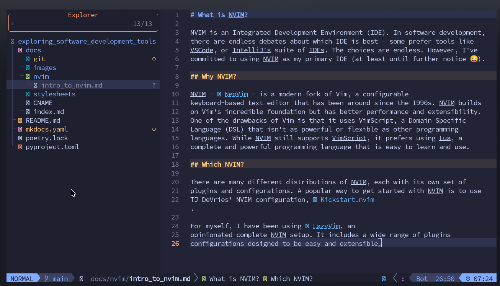

# What is NVIM?

NVIM is an Integrated Development Environment (IDE). In software development,
there are endless debates about which IDE is best - some prefer tools like
VSCode, or IntelliJ's suite of IDEs. The choices are endless. However, I've
committed to using NVIM as my primary IDE (at least until further notice 😜).

## Why NVIM?

NVIM - [NeoVim](https://neovim.io/) - is a modern fork of Vim, a configurable
keyboard-based text editor that has been around since the 1990s. NVIM builds
on Vim's incredible foundation but has better performance and extensibility.
One of the drawbacks of Vim is that it uses VimScript, a Domain Specific
Language (DSL) that isn't as powerful or flexible as other programming
languages. While NVIM still supports VimScript, it prefers using Lua, a
complete and powerful programming language that is easy to learn and use.

## Which NVIM?

There are many different distributions of NVIM, each with its own set of
plugins and configurations. A popular way to get started with NVIM is to use
TJ DeVries' NVIM configuration, [Kickstart.nvim](https://github.com/nvim-lua/kickstart.nvim).

For myself, I have been using [LazyVim](https://www.lazyvim.org/), an
opinionated complete NVIM setup. It includes a wide range of plugins
configurations designed to be easy and extensible.

Here's a screenshot of this file being created in LazyVim:

